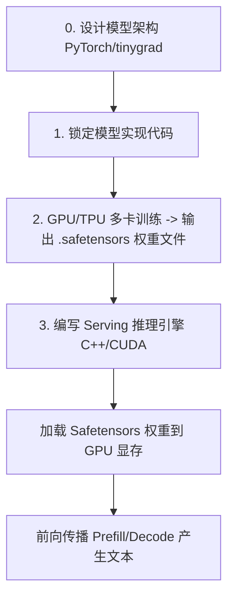

# 11. tiny-vllm：用 C++ 与 CUDA 从零手写极简 vLLM 推理引擎

> **导读**：本章节解构了开源优质项目 [jmaczan/tiny-vllm](https://github.com/jmaczan/tiny-vllm)。`tiny-vllm` 相当于高吞吐推理框架 vLLM 的“迷你小兄弟”。它脱离了复杂的 Python 封装与框架开销，使用纯正的 **C++17 与 CUDA C++** 从零构建了一个能加载真实大模型（Llama 3.2 1B Instruct）并具备 **Safetensors 解析、cuBLAS GEMM、Custom CUDA Kernels、Continuous Batching 以及 PagedAttention** 的高性能推理引擎。
> 
> * **项目 GitHub 链接**：[jmaczan/tiny-vllm](https://github.com/jmaczan/tiny-vllm)
> * **核心锚点章节**：[Intro: LLM, vLLM, models, inference servers](https://github.com/jmaczan/tiny-vllm#intro-llm-vllm-models-inference-servers)

---

## 1. 概念澄清：LLM、模型文件与推理引擎的本质

在开始编写代码之前，必须彻底理解一个核心问题：**大模型（LLM）文件到底是什么？推理引擎（Inference Server）在做什么？**



### 1.1 大模型的物理与逻辑本质
* **物理本质**：模型文件（如 `.safetensors`）本质上是一个**只包含巨量浮点数（Float Numbers）的数据文件**。它不是可执行二进制文件（Executable），无法直接在操作系统上双击运行。
* **逻辑本质**：这些浮点数代表训练阶段（Training）通过反向传播（Backpropagation）学习到的权重（Weights）。
* **架构蓝图**：模型的神经网络拓扑（如 Llama 3.2 的 Embedding $\rightarrow$ RMSNorm $\rightarrow$ Attention $\rightarrow$ MLP $\rightarrow$ Head）是计算的蓝图（Blueprint）。

### 1.2 为什么需要用 C++ / CUDA 构建推理引擎？
要让模型运行起来，必须编写一个**程序（Inference Engine）**：
1. 负责在启动时读取 `.safetensors` 权重文件并将其载入 GPU 显存；
2. 按照模型架构定义的操作顺序（Operations Workflow）执行前向传播（Forward Pass）；
3. 利用 CUDA 将大量矩阵乘法（GEMM）与 Attention 点积计算分发到 GPU 上数千个 CUDA 核心并行处理；
4. 响应用户的 HTTP / API 文本生成请求（Inference）。

使用 C++ 与 CUDA 编写推理引擎的目的，在于**彻底摆脱 Python 解释器的 GIL 锁与运行时开销，压榨硬件极限，提升吞吐量与并发数**。

---

## 2. `tiny-vllm` 核心技术栈与算子图谱

`tiny-vllm` 完整的 C++/CUDA 引擎包含以下核心功能点：

```
[Safetensors 文件解析] ──> [BF16 内存分配] ──> [Token Embedding CUDA Kernel]
                                                         │
                                                         ▼
[Paged KV Cache 物理内存池] ◄── [PagedAttention Kernel] ◄── [RMSNorm + Parallel Reduction]
                                                         │
                                                         ▼
[Continuous Batching 调度器] ──> [cuBLAS GEMM 矩阵乘法] ──> [SiLU / Argmax 采样]
```

### 2.1 Safetensors 权重文件二进制解析
Safetensors 是当前 AI 社区主流的权重保存格式。`tiny-vllm` 展示了如何在 C++ 中进行纯二进制解析：
* **Header Size (8 字节)**：文件前 8 字节为 `uint64_t`，记录后续 JSON Header 的字节长度。
* **Header (JSON)**：解析包含每个 Tensor 的名称、数据类型（`dtype`）、维度（`shape`）和文件偏移量（`offsets`）。
* **Tensor Data**：根据 `offsets` 直接映射并 `cudaMemcpy` 到 GPU 显存中。

### 2.2 为什么大模型推崇 `bfloat16` (BF16)？
* **位宽对比**：
  * **FP16**：1 bit 符号位 + 5 bits 指数位 + 10 bits 尾数位（动态范围小，容易溢出/下溢）。
  * **BF16**：1 bit 符号位 + **8 bits 指数位** + 7 bits 尾数位。
* **优势**：BF16 的指数位数与 32 位单精度浮点数 `FP32` 完全一致，拥有与 FP32 相同的超大数值动态范围，在保持 16 位显存体积的同时，大幅降低了深度学习训练与推理中的溢出风险。

---

## 3. 从单 Token 推理到 PagedAttention 的演进路线

`tiny-vllm` 带领开发者一步一步搭建完整引擎的递进路线：

| 阶段 | 核心技术模块 | 实现细节与 CUDA 优化 |
| :--- | :--- | :--- |
| **阶段一：Single Token 前向传播** | Embedding & RMSNorm | 手写 CUDA Kernel 实现 Token ID 查表与 Block 级 Parallel Reduction 规约求和 |
| **阶段二：线性代数加速** | cuBLAS GEMM & 转置技巧 | 使用 `cublasGemmEx` 执行 $Q, K, V$ 和 MLP 的矩阵乘法，运用 Column-Major 到 Row-Major 的转置技巧 |
| **阶段三：注意力机制** | GQA & RoPE | 实现 Grouped-Query Attention (GQA) 与旋转位置编码 (Rotary Position Embedding) |
| **阶段四：内存与 Batching 调度** | Continuous Batching | 告别静态批处理，实现 Iteration 级别的请求动态插入与弹出 |
| **阶段五：PagedAttention** | Paged KV Cache & Online Softmax | 引入物理 BlockTable 分页管理 KV Cache，结合 FlashAttention 风格的 Online Softmax CUDA Kernel |

---

## 4. 学习建议与项目价值

1. **最好的 JIT（Just-In-Time）学习教材**：
   `tiny-vllm` 代码量精简，干净利落，没有庞杂的生产框架历史包袱。对于想要深入理解 **vLLM 内部工作原理**、**CUDA 算子编写** 以及 **LLM 物理前向传播流程** 的开发者来说，是极具参考价值的手写教程。
2. **结合本知识库的串联学习**：
   * 在第 4、5 章中，我们从宏观视角剖析了 vLLM 的 Python/C++ 架构；
   * 在第 10 章中，我们用 PyTorch 手写了 KV Cache；
   * 而在第 11 章的 `tiny-vllm` 中，我们将这些思想全部用 **C++ 与 CUDA 硬件 Kernel** 落地实现！
