# 深入 vLLM：高吞吐量 LLM 推理系统的系统剖析

> **原标题**：[Inside vLLM: Anatomy of a High-Throughput LLM Inference System](https://www.aleksagordic.com/blog/vllm)  
> **作者**：Aleksa Gordić  
> **发布日期**：2025 年 8 月 29 日  
> **副标题**：从 PagedAttention、连续批处理（Continuous Batching）、前缀缓存（Prefix Caching）、投机解码（Speculative Decoding）等，到大规模多 GPU、多节点动态 Serving 服务

---

在这篇文章中，我将逐步介绍构成现代高吞吐量 LLM 推理系统的所有核心系统组件和高级特性。特别是，我将详细拆解 vLLM [[1]](https://github.com/vllm-project/vllm) 的工作原理。

这篇文章是一个系列的第一篇。它采用“倒金字塔”的方法——先从宏观视角切入，再层层剥离细节，使你能够在不淹没于繁琐细节的情况下，对整个系统建立起准确的高层心智模型。

后续的文章将深入探讨各个特定的子系统。

本文结构分为五个部分：

1. [LLM Engine 与 Engine Core](#cpt1)：vLLM 的基础知识（调度、PagedAttention、连续批处理等）
2. [高级特性（Advanced Features）](#cpt2)：分块预填（Chunked Prefill）、前缀缓存（Prefix Caching）、语法约束解码（Guided Decoding）、投机解码（Speculative Decoding）、PD 分离
3. [规模化扩展（Scaling Up）](#cpt3)：从单 GPU 扩展到多 GPU 执行
4. [服务层（Serving Layer）](#cpt4)：分布式 / 高并发 Web 服务架构
5. [基准测试与自动调优（Benchmarks & Auto-Tuning）](#cpt5)：测量延迟与吞吐量

> 📝 **说明事项**
> - 本文分析基于 [Commit 42172ad](https://github.com/vllm-project/vllm/tree/42172ad)（2025 年 8 月 9 日）。
> - 目标受众：任何对 SOTA LLM 推理引擎工作原理感到好奇的人，以及有兴趣向 vLLM、SGLang 等开源项目贡献代码的开发者。
> - 本文重点关注 [V1 引擎](https://docs.vllm.ai/en/latest/usage/v1_guide.html)。我也研究过 V0 引擎（[现已废弃](https://github.com/vllm-project/vllm/issues/18571)），它对于理解项目演进非常有价值，且许多核心概念依然通用。
> - 第一部分关于 LLM Engine / Engine Core 的内容可能稍显枯燥或硬核 - 但博客的其余部分充满了丰富的示例与可视化图表。:)

---

<h2 id="cpt1">1. LLM Engine 与 Engine Core</h2>

LLM Engine 是 vLLM 最基础的构建块。单凭它自身，就已经能够实现极高的推理吞吐量——但仅限于离线（Offline）场景。你还无法直接通过 Web 接口向用户提供服务。

我们将使用以下离线推理代码片段作为贯穿全篇的运行示例（改编自 [basic.py](https://github.com/vllm-project/vllm/blob/main/examples/offline_inference/basic/basic.py)）。

```python
from vllm import LLM, SamplingParams

prompts = [
    "Hello, my name is",
    "The president of the United States is",
]

sampling_params = SamplingParams(temperature=0.8, top_p=0.95)

def main():
    llm = LLM(model="TinyLlama/TinyLlama-1.1B-Chat-v1.0")

    outputs = llm.generate(prompts, sampling_params)

if __name__ == "__main__":
    main()
```

> 📝 **环境变量设置：**
> - `VLLM_USE_V1="1"` # 启用 V1 引擎
> - `VLLM_ENABLE_V1_MULTIPROCESSING="0"` # 运行在单进程模式下

此配置的特点是：
- 离线（无 Web / 分布式系统脚手架）
- 同步（所有执行都在单个阻塞进程中发生）
- 单 GPU（无数据/模型/流水线/专家并行；DP/TP/PP/EP = 1）
- 使用标准 Transformer [[2]](https://arxiv.org/abs/1706.03762)（支持 Jamba 等混合架构模型需要更复杂的混合 KV-Cache 内存分配器）

由此出发，我们将逐步构建出一个在线、异步、多 GPU、多节点的推理系统——但依然服务于标准 Transformer。

在这个示例中，我们主要做了两件事：
1. 实例化一个 Engine 引擎
2. 调用 Engine 的 `generate` 方法对给定的 Prompt 进行采样生成

让我们开始分析 Engine 的构造函数。

### LLM Engine 构造函数

Engine 的主要组成部分包括：
- **vLLM Config**：包含配置模型、缓存、并行度等所有开关与参数。
- **Processor**：通过校验、分词（Tokenization）与预处理，将原始输入转换为 `EngineCoreRequests`。
- **Engine Core Client**：在当前运行示例中，我们使用 `InprocClient`（本质上等价于 `EngineCore`）；后续我们将逐步扩展到支持大规模 Serving 的 `DPLBAsyncMPClient`。
- **Output Processor**：将底层的 `EngineCoreOutputs` 转换为用户看到的 `RequestOutput`。

> 📝 **注意：** 随着 V0 引擎被废弃，类名和具体实现细节可能会发生变动。我将强调核心思想而非具体的函数签名，并适度抽象部分细节。

Engine Core 本身由以下几个子组件构成：
- **Model Executor**：驱动模型的前向传播（Forward Pass）。目前我们使用的是 `UniProcExecutor`（在单卡 GPU 上运行单个 `Worker` 进程）。后面我们将逐步升级到支持多 GPU 的 `MultiProcExecutor`。
- **Structured Output Manager**：用于语法约束解码（Guided Decoding，后续详述）。
- **Scheduler**：决定哪些请求进入下一个 Engine Step。它进一步包含：
  a. 策略配置：可以是 **FCFS**（先到先服务）或 **Priority**（高优先级请求优先服务）。
  b. `waiting`（等待）队列与 `running`（运行中）队列。
  c. **KV Cache Manager**：PagedAttention 的核心心脏 [[3]](https://arxiv.org/abs/2309.06180)。

KV-Cache Manager 维护着一个 `free_block_queue`——即可用 KV-Cache 物理块的资源池（根据显存大小和 BlockSize，通常包含数十万个 Block）。在 PagedAttention 机制中，这些 Block 作为索引结构，将逻辑 Token 映射到其计算出的 KV Cache 物理内存块上。

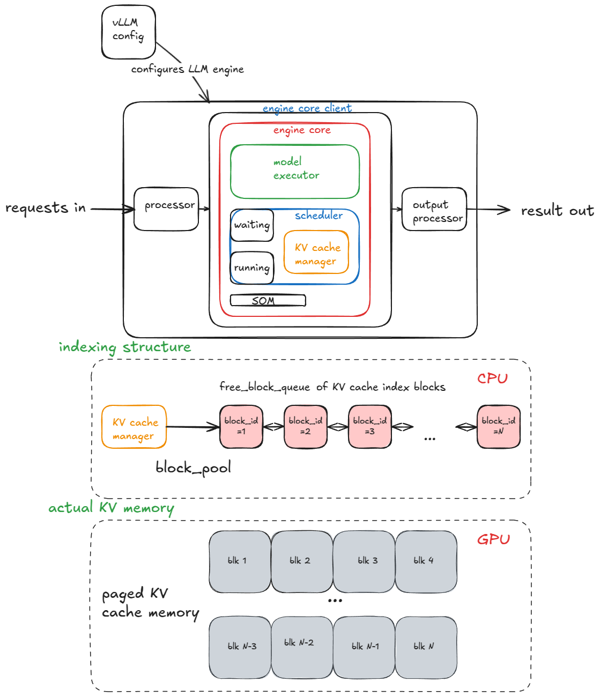
*本节描述的核心组件及其相互关系*

> 💡 对于标准 Transformer 层（非 MLA [[4]](https://arxiv.org/abs/2405.04434)），单个 Block 的显存大小计算公式如下：  
> `2 (Key/Value) * block_size (默认16) * num_kv_heads * head_size * dtype_num_bytes (例如 bf16 为 2 字节)`

在构造 Model Executor 期间，系统会创建一个 `Worker` 对象，并执行三个关键步骤（后续在使用 `MultiProcExecutor` 时，这些步骤会在不同 GPU 上的各个 Worker 进程中独立运行）：

1. **设备初始化（Init device）**：
   - 为 Worker 分配 CUDA 设备（例如 `"cuda:0"`）并检查模型数据类型（如 bf16）是否受支持。
   - 校验在指定的 `gpu_memory_utilization`（例如 0.8 表示使用 80% 显存）下是否有足够的显存。
   - 配置分布式设置（DP / TP / PP / EP 等）。
   - 实例化 `model_runner`（持有 Sampler、KV Cache 以及前向传播 Buffer，如 `input_ids`、`positions` 等）。
   - 实例化 `InputBatch` 对象（持有 CPU 侧的前向传播 Buffer、用于 KV-Cache 索引的 Block Table、采样元数据等）。
2. **加载模型（Load model）**：
   - 实例化模型架构。
   - 加载模型权重。
   - 调用 `model.eval()`（切换至 PyTorch 推理模式）。
   - 可选：对模型调用 `torch.compile()`。
3. **初始化 KV Cache**：
   - 获取逐层的 KV-Cache 规格（Spec）。历史上这始终是 `FullAttentionSpec`（同质 Transformer），但在滑动窗口或 Transformer/SSM 混合模型（如 Jamba）中变得更加复杂（参见 Jenga [[5]](https://arxiv.org/abs/2503.18292)）。
   - 运行一次 Dummy/Profiling 前向传播，抓取 GPU 显存快照，以精确计算剩余显存能够容纳多少个 KV Cache Block。
   - 分配、重构（Reshape）并绑定 KV Cache 张量到各个 Attention 层。
   - 准备 Attention 元数据（例如设置 Kernel 后端为 FlashAttention），供后续前向传播 Kernels 消费。
   - 除非指定了 `--enforce-eager`，否则系统会对预热 Batch Size 运行 Dummy 前向传播并捕获 **CUDA Graphs**。CUDA Graph 将一整套 GPU 操作录制为一个有向无环图（DAG），在后续前向传播中直接重放预录制的 Graph，从而消除 Kernel Launch 开销，大幅降低延迟。

这里我抽象掉了许多底层实现细节——但以上是核心脉络，后续章节中我们将不断引用它们。

初始化 Engine 完毕后，让我们进入 `generate` 函数的内部逻辑。

### Generate 函数

第一步是验证请求并将请求喂入 Engine。对于每个 Prompt：
1. 生成唯一的 Request ID 并记录到达时间。
2. 调用输入预处理器（Preprocessor）对 Prompt 进行 Tokenize，返回包含 `prompt`、`prompt_token_ids` 以及 `type`（文本、Token 数组、Embeddings 等）的字典。
3. 将上述信息打包为 `EngineCoreRequest`，加入优先级、采样参数及其他元数据。
4. 将请求传入 Engine Core，Engine Core 用 `Request` 对象封装它并将状态置为 `WAITING`。随后将该请求推入 Scheduler 的 `waiting` 队列（FCFS 模式下 append，Priority 模式下 Heap-Push）。

此时 Engine 已接收到请求，开始执行。在同步 Engine 示例中，传入的初始 Prompts 是仅有的处理对象——运行时没有中途注入新请求的机制。相比之下，异步 Engine 支持中途注入（即 **连续批处理 / Continuous Batching** [[6]](https://www.usenix.org/conference/osdi22/presentation/yu)）：在每个 Step 完成后，调度器会同时评估新到达的请求与旧请求。

> 💡 由于前向传播会将 Batch 打平为单个展平序列，并由自定义 Kernel 高效处理，因此即使在同步 Engine 中，连续批处理在底层也是天然支持的。

接着，只要还有未完成的请求，Engine 就会循环调用 `step()` 函数。每个 step 包含三个阶段：
1. **调度（Schedule）**：选择要在本 Step 中运行的请求（Decode 阶段，和/或 Chunked Prefill 阶段）。
2. **前向传播（Forward pass）**：运行模型计算并采样 Token。
3. **后处理（Postprocess）**：将采样的 Token ID 追加到对应的 `Request` 中，执行 Detokenize，并检查停止条件。若请求已完成，执行清理（如将 KV-Cache Block 归还给 `free_block_queue`）并提前返回输出。

> 📝 **停止条件包括：**
> - 请求达到长度限制（`max_model_length` 或请求自定义的 `max_tokens`）。
> - 采样的 Token 是 EOS ID（除非开启了 `ignore_eos` -> 在压测基准测试中强制生成指定数量 Token 时很有用）。
> - 采样的 Token 匹配了 SamplingParams 中指定的任何 `stop_token_ids`。
> - 输出中出现了指定的 Stop 字符串 - 系统会将输出截断至 Stop 字符串首次出现的位置并中止 Engine 中的该请求（注意 `stop_token_ids` 会包含在输出中，而 Stop 字符串则不会）。


*Engine 主循环流程*

> 💡 在流式（Streaming）模式下，中间生成 Token 会在产生时立即推送出去，这里我们暂时忽略流式细节。

接下来，我们将详细剖析调度器（Scheduler）。

### 调度器（Scheduler）

推理引擎处理的工作负载主要分为两类：
1. **Prefill（预填）请求**：对 Prompt 中所有 Token 进行一次性前向传播。这通常属于 **计算密集型（Compute-bound）**（阈值取决于硬件与 Prompt 长度）。结束时，从最后一个 Token 位置的概率分布中采样出一个 Token。
2. **Decode（解码）请求**：仅对最新生成的一个 Token 进行前向传播。所有历史 Token 的 KV 向量均已缓存。这属于 **内存带宽密集型（Memory-bandwidth-bound）**，因为仅仅为了计算一个 Token，仍然需要将完整的 LLM 权重（及 KV Caches）从 HBM 搬运到芯片上。

> 💡 在 [性能基准测试章节](#cpt5) 中，我们将分析 GPU 性能的 Roofline 模型，届时会更加深入地探讨 Prefill/Decode 的性能特征。

得益于更聪明的架构设计，V1 调度器可以在同一个 Step 中混合处理这两类请求。相比之下，V0 引擎在单个 Step 中只能纯处理 Prefill 或纯处理 Decode。

调度器会**优先保障 Decode 请求**——即已经在 `running` 队列中的请求。对于每个 Decode 请求：
1. 计算本 Step 需要生成的新 Token 数量（由于投机解码或异步调度，不一定总是 1，后续详述）。
2. 调用 KV-Cache Manager 的 `allocate_slots` 函数分配 Slot（细节见下文）。
3. 从 Token Budget 中扣除步骤 1 消耗的 Token 数量。

在此之后，调度器开始处理来自 `waiting` 队列的 **Prefill 请求**：
1. 查询已计算的 Block 数量（若禁用 Prefix Caching 则返回 0，后续详述）。
2. 调用 KV-Cache Manager 的 `allocate_slots` 函数。
3. 将请求从 waiting 队列弹出并移入 running 队列，将其状态设为 `RUNNING`。
4. 从 Token Budget 中扣除消耗数量。

现在让我们看看 `allocate_slots` 的具体工作：
1. **计算 Block 数量** — 确定需要分配多少个新的 KV-Cache Block（`n`）。默认每个 Block 存储 16 个 Token。例如，若一个 Prefill 请求有 17 个新 Token，则需要 `ceil(17/16) = 2` 个 Block。
2. **检查可用性** — 若资源池中的 Block 不足，提前退出。根据是 Decode 还是 Prefill 请求，Engine 可能会通过驱逐低优先级请求来触发重新计算抢占（Recompute Preemption，V0 中曾支持 Swap Preemption），即调用 `kv_cache_manager.free` 将 Block 归还给资源池；或者跳过本次调度继续执行。
3. **分配 Block** — 通过 KV-Cache Manager 的 Coordinator，从资源池（前述双向链表 `free_block_queue`）中取出前 `n` 个 Block。更新 `req_to_blocks` 字典（记录每个 `request_id` 到其物理 KV Block 列表的映射）。

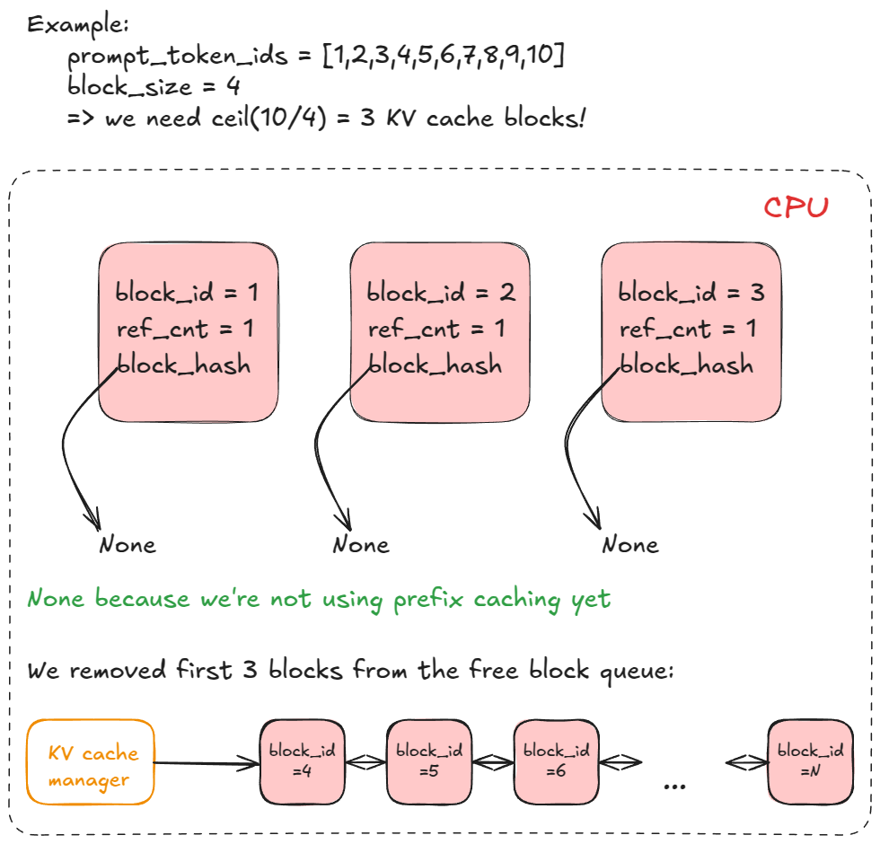
*KV Cache Block 链表与资源池*

我们终于准备好执行前向传播了！

### 执行前向传播（Run forward pass）

我们调用 Model Executor 的 `execute_model`，它委托给 `Worker`，Worker 再委托给 `model_runner`。

主要步骤如下：
1. **更新状态（Update states）** — 从 `input_batch` 中清理已完成的请求；更新前向传播相关的元数据（例如用于索引 Paged KV Cache 显存的物理 Block Table）。
2. **准备输入（Prepare inputs）** — 将 Buffer 从 CPU 拷贝至 GPU；计算 Position IDs；构建 `slot_mapping`；构造 Attention 元数据。
3. **前向传播（Forward pass）** — 运行带有自定义 PagedAttention Kernel 的模型。所有序列被打平并拼接为一根很长的 "Super-Sequence"。Position IDs 与 Attention Mask 确保每个序列仅注意力集中在自身的 Token 上，从而实现了无 Right-Padding 的连续批处理。
4. **提取末尾 Token 状态（Gather last-token states）** — 提取每个序列最后一个位置的 Hidden States 并计算 Logits。
5. **采样（Sample）** — 根据采样配置（Greedy, Temperature, Top-P, Top-K 等）从 Logits 中采样生成 Token。

前向传播步骤本身支持两种执行模式：
1. **Eager 模式** — 当启用 Eager 执行时，运行标准的 PyTorch 前向传播。
2. **"Captured" 模式** — 当未强制 Eager 模式时，直接执行/重放预先捕获的 CUDA Graph（还记得吗？这些是在 Engine 构造阶段初始化 KV Cache 时捕获的）。

以下是一个具体的图解示例，直观展示连续批处理与 PagedAttention 的配合：

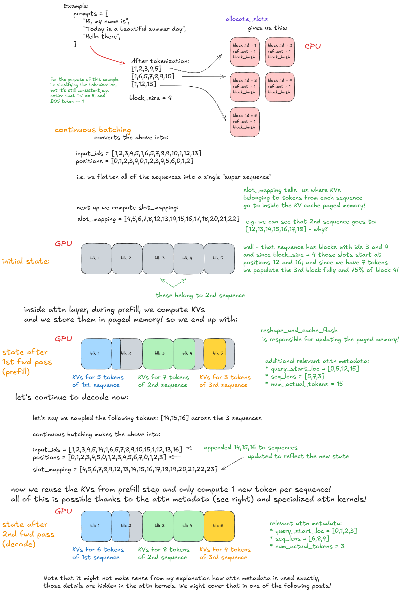
*前向传播：连续批处理与 PagedAttention 运行图*

---

<h2 id="cpt2">2. 高级特性（Advanced Features）—— 扩展核心引擎逻辑</h2>

在厘清基础 Engine 流程之后，我们现在探讨各种高级扩展特性。

前面我们已经讨论了抢占（Preemption）、PagedAttention 以及连续批处理（Continuous Batching）。

接下来我们将深入：
1. 分块预填（Chunked Prefill）
2. 前缀缓存（Prefix Caching）
3. 语法约束解码（Guided Decoding，通过语法约束的有限状态自动机 FSM）
4. 投机解码（Speculative Decoding）
5. PD 分离（Disaggregated Prefill/Decoding）

### 分块预填（Chunked Prefill）

Chunked Prefill 是一种通过将超长 Prompt 的 Prefill 阶段拆分为多个较小 Chunk 来处理的技术。如果不进行分块，单个极长的请求可能会独占某一个 Engine Step，导致其他请求无法运行，从而拖垮所有请求的延迟。

例如，假设每个 Chunk 包含 `n` (=8) 个 Token，用小写字母和 "-" 表示。一个长 Prompt `P` 可以表示为 `x-y-z`，其中 `z` 是未填满的 Chunk（如 2 个 Token）。执行 `P` 的完整 Prefill 将消耗 $\ge 3$ 个 Engine Step，并且只有在最后一个 Chunked Prefill Step 完成时，我们才能采样出第一个新 Token。

下图直观展示了该过程：

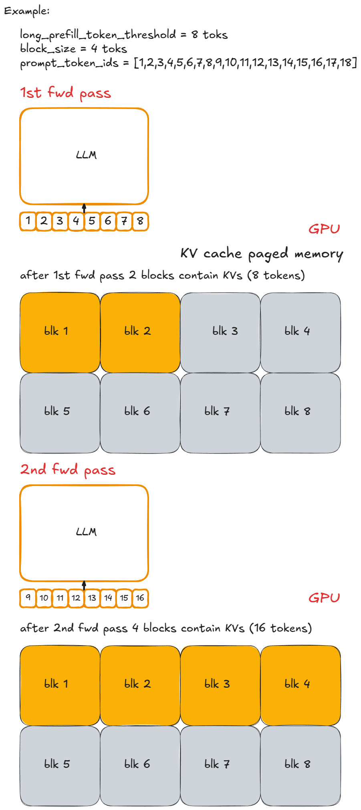

实现原理非常直观：限制每个 Step 计算的新 Token 数量上限。若请求的 Token 数超过 `long_prefill_token_threshold`，则将其重置为该阈值。底层索引逻辑（前面已介绍）会自动处理剩余部分。

在 vLLM V1 中，只需将 `long_prefill_token_threshold` 设置为正整数即可启用 Chunked Prefill。（技术上，如果 Prompt 长度超过了整体 Token Budget，即使未达到该阈值也会自动截断执行 Chunked Prefill。）

### 前缀缓存（Prefix Caching）

为了说明 Prefix Caching 的原理，让我们对最初的代码示例稍作修改：

```python
from vllm import LLM, SamplingParams

long_prefix = "<a piece of text that is encoded into more than block_size tokens>"

prompts = [
    "Hello, my name is",
    "The president of the United States is",
]

sampling_params = SamplingParams(temperature=0.8, top_p=0.95)

def main():
    llm = LLM(model="TinyLlama/TinyLlama-1.1B-Chat-v1.0")

    outputs = llm.generate(long_prefix + prompts[0], sampling_params)
    outputs = llm.generate(long_prefix + prompts[1], sampling_params)

if __name__ == "__main__":
    main()
```

Prefix Caching 的核心在于：**避免重复计算多个 Prompt 开头共享的 Token**（即 Prefix）。

关键在于 `long_prefix`：它被定义为任何长度超过单个 KV-Cache Block（默认 16 Token）的前缀。为了简化说明，假设 `long_prefix` 的长度刚好等于 `n x block_size`（`n ≥ 1`）。

> 💡 即它完美地对齐了 Block 边界——否则由于无法缓存未满的 Block，我们不得不重新计算 `long_prefix_len % block_size` 个 Token。

如果没有 Prefix Caching，每次处理带有相同 `long_prefix` 的新请求时，我们都需要重新计算全部 `n x block_size` 个 Token。

开启 Prefix Caching 后，这些 Token 只在第一次时计算一次（其 KV 值保存在 Paged KV Cache 显存中）并被后续请求复用，因此新请求只需要计算其独特的后缀 Token。这大幅加速了 Prefill 阶段（虽然对 Decode 阶段没有直接帮助）。

在 vLLM 中它是如何工作的？

在第一次调用 `generate` 的调度阶段，在 `kv_cache_manager.get_computed_blocks` 内部，Engine 会调用 `hash_request_tokens`：
1. 该函数将 `long_prefix + prompts[0]` 切分为 16-Token 的块。
2. 对于每个完整的块，计算一个 Hash 值（使用内置 Hash 或 SHA-256，后者较慢但冲突率极低）。Hash 融合了前一个 Block 的 Hash、当前 Block 的 Tokens 以及可选元数据。
> 💡 可选元数据包括：多模态 Hash、LoRA ID、Cache Salt（注入到首个 Block Hash 中，确保仅带有相同 Salt 的请求才能复用该 Cache）。
3. 每个计算结果被存为 `BlockHash` 对象（包含 Hash 值与 Token IDs）。返回 Block Hash 列表。

该列表被保存在 `self.req_to_block_hashes[request_id]` 中。

接着，Engine 调用 `find_longest_cache_hit` 检查这些 Hash 是否已存在于 `cached_block_hash_to_block` 中。第一次请求时，未命中任何 Cache。

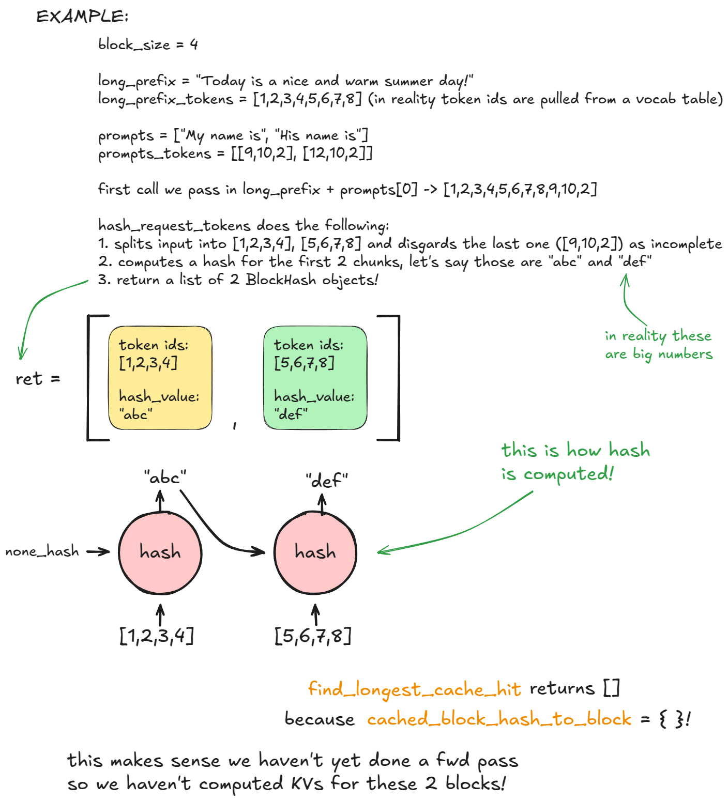

随后调用 `allocate_slots`，进一步调用 `coordinator.cache_blocks`，将新建的 `BlockHash` 条目与分配的物理 KV Block 建立映射，并记录到 `cached_block_hash_to_block` 中。

之后的前向传播会将计算出的 KV 值填入这些物理 KV Block 对应的显存中。

> 💡 随着 Engine 运行多个 Step，它会分配更多的 KV Block，但这不影响本例，因为在 `long_prefix` 之后序列已经分化。

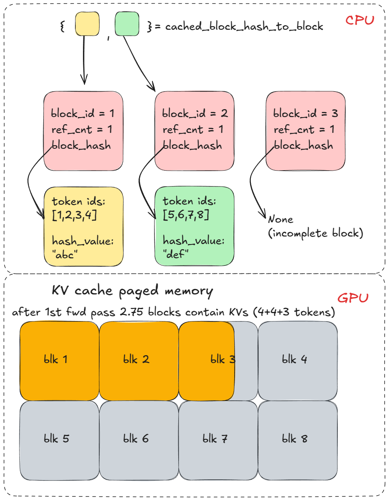

当发起带有相同 Prefix 的第二个 `generate` 请求时，步骤 1-3 重复执行。但此时 `find_longest_cache_hit` 线性搜索到了所有 `n` 个 Block 的匹配项。Engine 可以直接复用这些物理 KV Block！

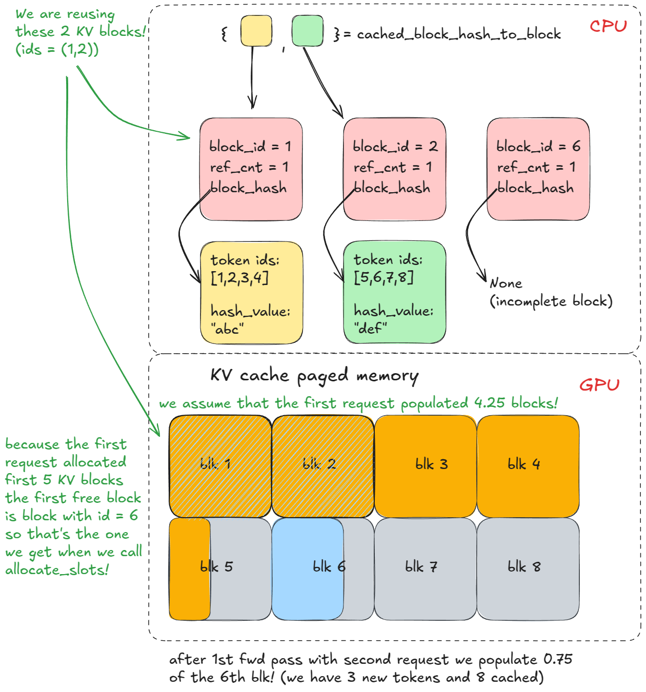

如果第一个请求仍然在运行，这些 Block 的引用计数会递增（例如变为 2）。在本例中，第一个请求已经完成，Block 已归还给资源池，引用计数复位为 0。但因为我们能从 `cached_block_hash_to_block` 中检索到它们，说明其内容依然有效，因此只需将它们从 `free_block_queue` 中再次重新取出即可。

> 📝 **高级补充：** 物理 KV-Cache Block 只有在其即将从 `free_block_queue`（从左侧 Pop）被重新分配时，如果我们发现该 Block 仍关联着旧 Hash 且存在于 `cached_block_hash_to_block` 中，它的 Cache 才会失效。此时，我们清除该 Block 的 Hash 并从 `cached_block_hash_to_block` 中移除它，确保它不会再被旧 Prefix 复用。

这就是 Prefix Caching 的精髓：**不要重复计算已经见过的 Prefix——直接复用它们的 KV Cache！**

> 💡 如果你理解了这个例子，你就已经真正理解了 PagedAttention 的工作原理。

Prefix Caching 在 vLLM 中默认启用。如需禁用，设置 `enable_prefix_caching = False`。

### 语法约束解码（Guided Decoding / FSM）

Guided Decoding 是一种在每个解码步骤中，通过基于语法的有限状态自动机（FSM）来约束 Logits 的技术。这确保了只有符合语法规则的 Token 才能被采样输出。

这是一个非常强大的功能：你可以强制模型输出任何内容，从正则文法（Chomsky 3 型文法，如任意 Regex 表达式），到上下文无关文法（2 型文法，覆盖了大多数编程语言）。

为了使其更加直观，让我们基于之前的代码来看一个最简单的示例：

```python
from vllm import LLM, SamplingParams
from vllm.sampling_params import GuidedDecodingParams

prompts = [
    "This sucks",
    "The weather is beautiful",
]

guided_decoding_params = GuidedDecodingParams(choice=["Positive", "Negative"])
sampling_params = SamplingParams(guided_decoding=guided_decoding_params)

def main():
    llm = LLM(model="TinyLlama/TinyLlama-1.1B-Chat-v1.0")

    outputs = llm.generate(prompts, sampling_params)

if __name__ == "__main__":
    main()
```

在上面的示例中，模型的输出被严格限制为只能是 `"Positive"` 或 `"Negative"`。

在 vLLM 中它是如何工作的？

**初始化配置（在 Engine 构造期间）：**
1. 在 Engine Core 内部初始化 `StructuredOutputManager`。
2. 初始化 Backend（默认情况下 vLLM V1 使用 XGrammar [[7]](https://arxiv.org/abs/2411.15100)，但也通过插件支持 Outlines 或 Guidance 等框架）。

**在 `generate` 函数中（当请求到达时）：**
1. 读取 `guided_decoding_params`（本例中为 `choice=["Positive", "Negative"]`）。
2. 将该约束转换为正则表达式 `(Positive|Negative)`，并传给 XGrammar 编译为一个 FSM 自动机。
3. 将编译好的 FSM 保存在 `request.guided_decoding_state` 中。

**在前向传播的每个 Decode Step 期间：**
1. 获取当前 FSM 状态下合法的 Token 集合。例如：
   - 初始状态（生成开头）：允许的 Token 是那些可以作为 "Positive" 或 "Negative" 开头的词元（如 "Pos", "Neg", "P", "N"）。
2. 在整个词表（Vocabulary）上构造一个 Bitmask（合法 Token 设为 1，非法 Token 设为 0）。
3. 在采样前将 Mask 作用于 Logits（将非法 Token 的 Logits 设为 $-\infty$）。
4. 采样下一个 Token 并推进 FSM 状态（例如若采样出了 "Pos"，下一个状态仅允许能够接续完成 "itive" 的 Token）。

下图展示了相同的逻辑：

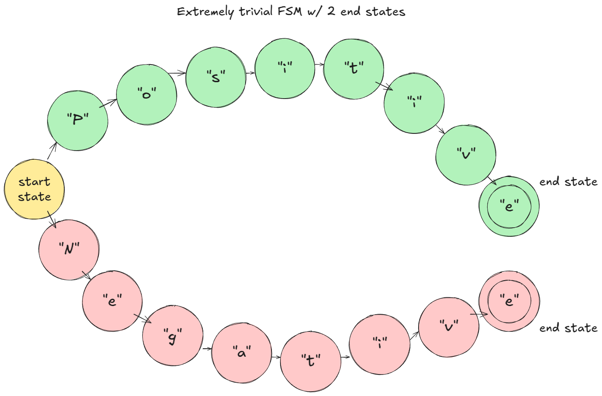


这就是 Guided Decoding 的核心运作机制！

### 投机解码（Speculative Decoding）

投机解码 [[8]](https://arxiv.org/abs/2302.01318) 是一种加速 LLM 解码的技术。它使用一个轻量快速的“草稿模型”（Draft Model）预预测未来的若干个 Token（例如 $K=3$ 个），然后使用大号的“目标模型”（Target Model）在单个并行前向传播中对这 $K$ 个 Token 进行一次性校验。

如果目标模型接受了其中的 $M \le K$ 个草稿 Token，我们就相当于在单个目标模型 Step 中成功生成了 $M+1$ 个 Token，从而大幅降低延迟。

以下是在 vLLM 中使用 `ngram` 作为 Draft 方法调用投机解码的示例：

```python
from vllm import LLM, SamplingParams

prompts = [
    "Hello, my name is",
    "The president of the United States is",
]

sampling_params = SamplingParams(temperature=0.8, top_p=0.95)

speculative_config = {
    "method": "ngram",
    "prompt_lookup_max": 5,
    "prompt_lookup_min": 3,
    "num_speculative_tokens": 3,
}

def main():
    llm = LLM(model="TinyLlama/TinyLlama-1.1B-Chat-v1.0", speculative_config=speculative_config)

    outputs = llm.generate(prompts, sampling_params)

if __name__ == "__main__":
    main()
```

在 vLLM 中它是如何工作的？

**初始化配置（在 Engine 构造期间）：**
1. **设备初始化**：创建 `drafter`（Draft Model，例如 `NgramProposer`）以及基于 Triton 实现的 `rejection_sampler`。
2. **加载模型**：加载 Draft Model 的权重（对于 N-gram 模式为无操作）。

**在 `generate` 函数中（假设接收到一个全新请求）：**
1. 使用 Target 大模型运行常规的 Prefill Step。
2. 在前向传播与标准采样之后，调用 `propose_draft_token_ids(k)` 从 Draft Model 中采样出 $k$ 个草稿 Token。
3. 将这些 Token 存入 `request.spec_token_ids`（更新请求元数据）。
4. 在下一个 Engine Step 中，当请求处于 Running 队列时，将 `len(request.spec_token_ids)` 累加到“新 Token”计数中，以便 `allocate_slots` 预留足够的物理 KV Block。
5. 将 `spec_token_ids` 拷贝到 `input_batch.token_ids_cpu` 中，形成 (Context + Draft) 组合 Token 序列。
6. 通过 `_calc_spec_decode_metadata` 计算元数据，然后在 Target 大模型上对这些草稿 Token 执行一次并行前向传播。
7. 不使用常规 Logits 采样，而是通过 `rejection_sampler` 从左到右依次执行接受/拒绝判定，生成最终的 `output_token_ids`。
8. 重复步骤 2-7，直到触发停止条件。

掌握这一机制的最佳方式是启动调试器单步跟踪代码，但希望本节内容能让你对其全貌有一个直观感受。示意图如下：


*Drafting 草稿生成阶段*


*Verify 验证与 Rejection Sampling 阶段*

### PD 分离（Disaggregated P/D）

前文已经暗含了 PD（Prefill/Decode）分离的动机。

Prefill 和 Decode 具有完全不同的性能特征（计算密集型 vs. 内存带宽密集型），因此将它们的执行在物理硬件上解耦是一种非常合理的架构设计。它能够对延迟指标——包括 `TTFT`（首字延迟）与 `ITL`（字间延迟）——提供更精准的控制（详见 [性能基准测试章节](#cpt5)）。

在实际生产中，我们部署 $N$ 个 vLLM Prefill 实例与 $M$ 个 vLLM Decode 实例，并根据实时流量动态弹性缩容/扩容。Prefill 节点将计算出的 KV Cache 写入专用的 KV-Cache 服务，Decode 节点从中读取。这实现了将突发的长 Prompt Prefill 负载与敏感稳定的 Decode 延迟隔离。

在 vLLM 中它是如何工作的？

为了便于说明，下面的示例采用了 `SharedStorageConnector`（一个用于演示原理的调试用 Connector 实现）。

> 💡 Connector 是 vLLM 用于在不同实例间交换 KV Cache 的核心抽象。目前 Connector 接口仍处于演进阶段。

我们启动 2 个 vLLM 实例（GPU 0 用于 Prefill，GPU 1 用于 Decode），并在它们之间传输 KV Cache：

```python
import os
import time
from multiprocessing import Event, Process
import multiprocessing as mp

from vllm import LLM, SamplingParams
from vllm.config import KVTransferConfig

prompts = [
    "Hello, my name is",
    "The president of the United States is",
]

def run_prefill(prefill_done):
    os.environ["CUDA_VISIBLE_DEVICES"] = "0"

    sampling_params = SamplingParams(temperature=0, top_p=0.95, max_tokens=1)

    ktc = KVTransferConfig(
        kv_connector="SharedStorageConnector",
        kv_role="kv_both",
        kv_connector_extra_config={"shared_storage_path": "local_storage"},
    )

    llm = LLM(model="TinyLlama/TinyLlama-1.1B-Chat-v1.0", kv_transfer_config=ktc)
    llm.generate(prompts, sampling_params)

    prefill_done.set()  # 通知 Decode 实例 KV Cache 已准备就绪

    # 保持 Prefill 节点运行，防止在 Decode 未完成时脚本提前退出
    try:
        while True:
            time.sleep(1)
    except KeyboardInterrupt:
        print("Script stopped by user.")

def run_decode(prefill_done):
    os.environ["CUDA_VISIBLE_DEVICES"] = "1"

    sampling_params = SamplingParams(temperature=0, top_p=0.95)

    ktc = KVTransferConfig(
        kv_connector="SharedStorageConnector",
        kv_role="kv_both",
        kv_connector_extra_config={"shared_storage_path": "local_storage"},
    )

    llm = LLM(model="TinyLlama/TinyLlama-1.1B-Chat-v1.0", kv_transfer_config=ktc)

    prefill_done.wait()  # 阻塞等待 Prefill 实例完成 KV Cache 传输

    # 在内部，它会在启动解码循环前首先拉取外部 KV Cache
    outputs = llm.generate(prompts, sampling_params)

if __name__ == "__main__":
    prefill_done = Event()
    prefill_process = Process(target=run_prefill, args=(prefill_done,))
    decode_process = Process(target=run_decode, args=(prefill_done,))

    prefill_process.start()
    decode_process.start()

    decode_process.join()
    prefill_process.terminate()
```

> 📝 **补充说明：** 我也尝试过 `LMCache` [[11]](https://github.com/LMCache/LMCache)（目前最快且面向生产环境的 Connector，基于 NVIDIA NIXL/RDMA 作为后端），但由于它更新极快且包含外部仓库依赖，使用 `SharedStorageConnector` 更适合用于教学阐述。

在 vLLM 中的内部步骤如下：
1. **实例化（Instantiation）** — 在 Engine 构造期间，Connector 会在两个地方被创建：
   - 在 Worker 设备初始化的分布式环境函数中，角色标记为 `"worker"`。
   - 在 Scheduler 构造函数中，角色标记为 `"scheduler"`。
2. **Cache 检索（Cache lookup）** — 当 Scheduler 处理 `waiting` 队列中的 Prefill 请求时（在完成本地 Prefix-Cache 检查后），它会调用 Connector 的 `get_num_new_matched_tokens` 检查外部 KV 缓存服务器中是否存在已缓存的 Token。Prefill 节点在此处始终返回 0；Decode 节点可能命中 Cache。返回的结果会被计入本地 Token 计数，然后再调用 `allocate_slots`。
3. **状态更新（State update）** — Scheduler 随后调用 `connector.update_state_after_alloc`，记录建立了 Cache 关联的请求（Prefill 节点上为 No-Op）。
4. **元数据构建（Meta build）** — 调度结束时，Scheduler 调用 `meta = connector.build_connector_meta`：
   - Prefill 标记所有需要上传 KV 的请求为 `is_store=True`。
   - Decode 标记所有需要拉取 KV 的请求为 `is_store=False`。
5. **上下文管理器（Context manager）** — 在前向传播之前，Engine 进入一个 KV-Connector 上下文管理器：
   - 进入（On enter）：调用 `kv_connector.start_load_kv`。对于 Decode 节点，它从外部服务器拉取 KV 并注入到物理 Paged KV 显存中；对于 Prefill 节点为 No-Op。
   - 退出（On exit）：调用 `kv_connector.wait_for_save`。对于 Prefill 节点，它会阻塞直到 KV Cache 成功上传发送至外部服务器；对于 Decode 节点为 No-Op。

可视化过程如下：

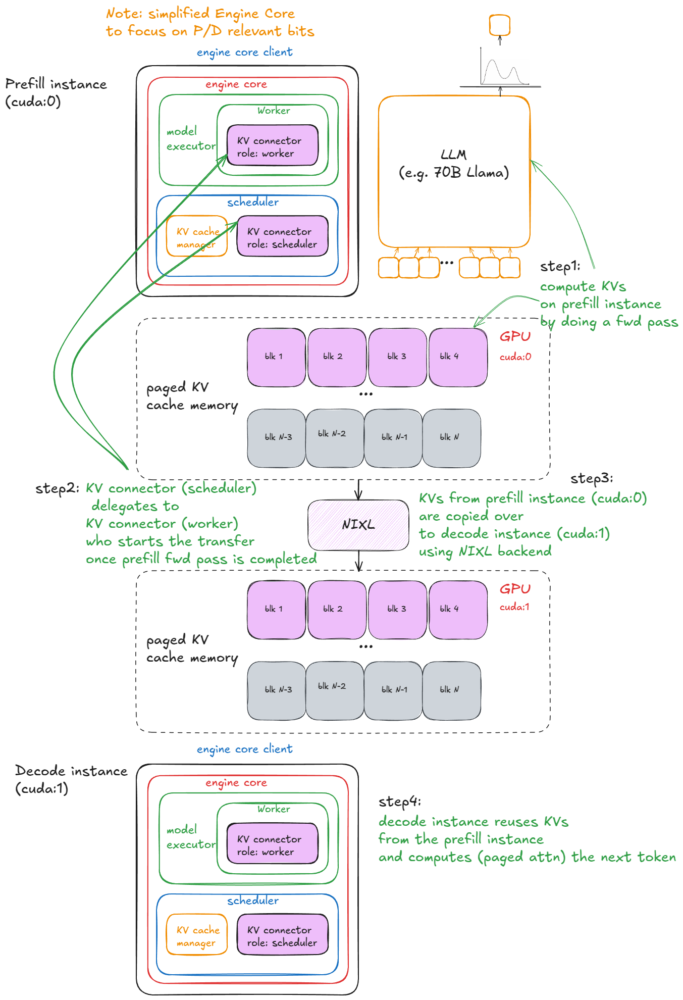
*Disaggregated P/D (PD 分离架构)*

> 📝 **补充细节：**
> - 对于 `SharedStorageConnector`，“外部服务器”本质上就是本地共享文件系统。
> - 根据配置，KV 传输也可以做到逐层（Layer-by-Layer）传输（在每个 Attention 层前后进行）。
> - Decode 节点仅在其请求的首个 Step 加载一次外部 KV；之后的新 Token 均在本地计算并保存。

---

<h2 id="cpt3">3. 从 UniprocExecutor 升级至 MultiProcExecutor</h2>

在掌握了核心技术之后，我们现在探讨如何向上扩展系统规模（Scaling Up）。

假设你的模型权重非常庞大，单张 GPU 的显存已无法容纳。

第一种方案是使用**张量并行**（Tensor Parallelism, TP，例如 `TP=8`），将模型切分到同一节点内的多张 GPU 上。如果单节点显存仍然不够，下一步就是跨节点使用**流水线并行**（Pipeline Parallelism, PP）。

> 📝 **说明事项：**
> - 节点内带宽（NVLink）远高于节点间带宽，因此张量并行（TP）通常优先于流水线并行（PP）。（同时 PP 传输的数据量也少于 TP。）
> - 此处我不讨论专家并行（EP），因为我们聚焦于标准 Transformer 而非 MoE；也不讨论序列并行（SP）。TP 与 PP 是工业实践中最常用的方案。

在此阶段，我们需要管理多个 GPU 进程（Workers），并引入一个协调层来对其进行调度。这正是 `MultiProcExecutor` 所提供的功能。


*MultiProcExecutor 在 TP=8 配置下的架构（Rank 0 为 Driver Worker）*

在 vLLM 中它的工作机制如下：
1. `MultiProcExecutor` 初始化一个 `rpc_broadcast_mq` 消息队列（底层基于共享内存 Shared Memory 实现）。
2. 构造函数遍历 `world_size`（例如 `TP=8 ⇒ world_size=8`），并通过 `WorkerProc.make_worker_process` 为每个 Rank 派生一个守护进程。
3. 对于每个 Worker，主进程首先创建 Pipe 读取和写入管道。
4. 新进程运行 `WorkerProc.worker_main`，实例化 Worker 对象（执行与 `UniProcExecutor` 相同的“设备初始化”、“加载模型”等流程）。
5. 每个 Worker 确认自己是 Driver Worker（TP 组中的 Rank 0）还是普通的 Worker。所有 Worker 设置两个队列：
   - `rpc_broadcast_mq`（与主进程共享）：用于接收计算指令。
   - `worker_response_mq`：用于将计算结果发回主进程。
6. 初始化期间，每个子进程通过 Pipe 将其 `worker_response_mq` 句柄发送给主进程。主进程接收到所有句柄后解除阻塞——握手协调完成。
7. Worker 进入忙等待循环，阻塞在 `rpc_broadcast_mq.dequeue` 上。当新的计算任务到达时，执行任务（逻辑与 `UniProcExecutor` 相同，但此时处理的是 TP/PP 切分后的分片数据）。结果通过 `worker_response_mq.enqueue` 发回。
8. 运行时，当新请求到达时，`MultiProcExecutor` 将其非阻塞地推入 `rpc_broadcast_mq` 广播给所有 Worker。然后等待指定的 Output Rank（Rank 0）在 `worker_response_mq.dequeue` 中推回最终结果。

从上层 Engine 的角度来看，一切没有任何改变——所有的多进程并行复杂性都被封装在 Model Executor 的 `execute_model` 调用之下。
- 在 `UniProcExecutor` 中：`execute_model` 直接调用单 Worker 的 `execute_model`。
- 在 `MultiProcExecutor` 中：`execute_model` 通过 `rpc_broadcast_mq` 间接调用每个 Worker 进程的 `execute_model`。

至此，只要硬件资源足够，我们就可以使用统一的 Engine 接口运行任意规模的超大模型。

下一步是横向扩展（Scaling Out）：启用数据并行（`DP > 1`）在多节点间复制模型副本，加入轻量级 DP 协调层，在副本间引入负载均衡，并在前端部署一个或多个 API Server 来接收外部并发流量。

---

<h2 id="cpt4">4. 分布式 Serving 架构</h2>

设置 Serving 架构的方式有很多，为了具体化，这里展示一个典型例子：假设我们有两个 8xH100 节点，希望在它们上面运行 4 个 vLLM Engine 实例。

如果模型需要 `TP=4`，我们可以这样配置节点：


*2 个 8xH100 节点配置示例（1 个 Headless 节点，1 个 API Server 节点）*

在第一个节点上，以 Headless 模式（无 API Server）运行 Engine：

```bash
vllm serve <model-name> \
  --tensor-parallel-size 4 \
  --data-parallel-size 4 \
  --data-parallel-size-local 2 \
  --data-parallel-start-rank 0 \
  --data-parallel-address <master-ip> \
  --data-parallel-rpc-port 13345 \
  --headless
```

在另一个节点上运行相同的命令，只需微调参数：
- 去掉 `--headless`
- 修改 DP 起始 Rank（start rank）

```bash
vllm serve <model-name> \
  --tensor-parallel-size 4 \
  --data-parallel-size 4 \
  --data-parallel-size-local 2 \
  --data-parallel-start-rank 2 \
  --data-parallel-address <master-ip> \
  --data-parallel-rpc-port 13345
```

> 📝 **注意：** 这假设网络已配置妥当，所有节点均可互通指定的 IP 和端口。

在 vLLM 内部这是如何工作的？

### 在 Headless Server 节点上

在 Headless 节点上，`CoreEngineProcManager` 根据 `--data-parallel-size-local` 参数启动 2 个进程，每个进程运行 `EngineCoreProc.run_engine_core`。这些函数各自创建一个 `DPEngineCoreProc`（Engine 核心），然后进入 busy loop 循环。

`DPEngineCoreProc` 初始化其父类 `EngineCoreProc`（`EngineCore` 的子类），执行：
1. 创建 `input_queue` 和 `output_queue`（`queue.Queue`）。
2. 使用 ZMQ `DEALER` Socket（异步消息库）与另一节点上的 Frontend 完成初始握手，并接收协调地址信息。
3. 初始化 DP 组（例如使用 NCCL 后端）。
4. 使用 `MultiProcExecutor` 初始化 `EngineCore`（如前所述在 4 张 GPU 上运行 `TP=4`）。
5. 创建 `ready_event`（`threading.Event`）。
6. 启动一个输入守护线程（`threading.Thread`）运行 `process_input_sockets(..., ready_event)`。类似地启动一个输出线程。
7. 主线程阻塞等待 `ready_event`，直到跨越 2 个节点的全部 4 个进程中的所有 Input 线程都完成了协调握手并执行 `ready_event.set()`。
8. 解除阻塞后，向 Frontend 发送 `"ready"` 消息及元数据（例如物理 Paged KV 显存中可用的 `num_gpu_blocks` 数量）。
9. 主线程、Input 线程和 Output 线程随后分别进入各自的稳态 busy loop 循环。

**TL;DR**：最终我们得到 4 个子进程（每个 DP 副本一个），每个进程内部运行 Main Thread、Input Thread 和 Output Thread。它们与 DP Coordinator 和 Frontend 完成握手后，三线程在稳态下高效并发运转。

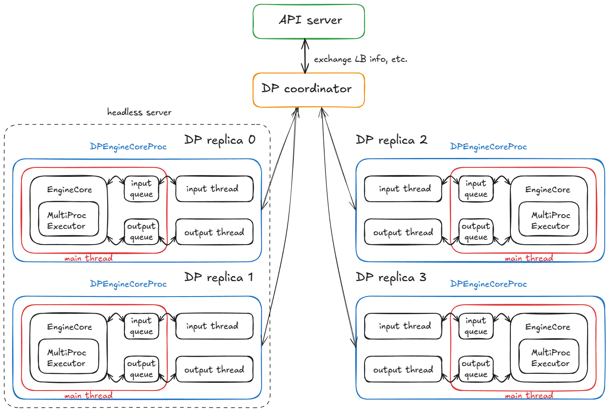
*运行 4 个 DPEngineCoreProc 的 4 副本分布式系统*

**稳态工作流：**
- **Input Thread（输入线程）** — 阻塞在 Input Socket 上，直到 API Server 路由过来一个请求；收到请求后解码 Payload，通过 `input_queue.put_nowait(...)` 非阻塞地推入队列，然后重新回到 Socket 阻塞等待。
- **Main Thread（主线程）** — 被 `input_queue.get(...)` 唤醒，将请求喂入 Engine；`MultiProcExecutor` 执行前向传播计算并将结果推入 `output_queue`。
- **Output Thread（输出线程）** — 被 `output_queue.get(...)` 唤醒，通过 Output Socket 将结果发回 API Server，随后恢复阻塞。

**其他核心机制：**
- **DP Wave Counter** — 系统追踪 "Waves" 波动；当所有 Engine 处于空闲时进入静默状态，当新任务到达时 Counter 递增（用于全局协调与指标统计）。
- **Control Messages** — API Server 除了发送推理请求外，还可以发送控制 RPC（如中断请求 Abort、配置管理等）。
- **Lockstep 锁步与 Dummy Step** — 若任何 DP 副本有计算任务，所有副本均需要配合执行一个 Forward Step；没有请求的副本会执行 Dummy Step 参与必要的同步点（防止阻塞正在活跃计算的副本）。

> 💡 **Lockstep 锁步澄清**：这实际上主要用于 MoE 模型（其中 Expert 层组成 EP/TP 组，而 Attention 层仍为 DP）。目前在普通 DP 中也默认执行，这主要是因为非 MoE 的纯 DP 可以在外部直接运行多个独立 vLLM 并配合通用 Load Balancer 部署，无需强依赖内置 DP。

接下来看第二部分：API Server 节点上发生了什么？

### 在 API Server 节点上

我们实例化一个 `AsyncLLM` 对象（LLM Engine 的 asyncio 包装器）。在内部，它会创建一个 `DPLBAsyncMPClient`（数据并行、负载均衡、异步多进程 Client）。

在父类 `MPClient` 内部，运行 `launch_core_engines`：
1. 创建用于启动握手的 ZMQ 地址。
2. 派生一个 `DPCoordinator` 进程。
3. 创建 `CoreEngineProcManager`。

在 `AsyncMPClient` 内部：
1. 创建 `outputs_queue`（`asyncio.Queue`）。
2. 创建 asyncio 异步任务 `process_outputs_socket`，通过 Output Socket 与所有 4 个 `DPEngineCoreProc` 的 Output Thread 通信，并将数据写入 `outputs_queue`。
3. `AsyncLLM` 的另一个 asyncio 任务 `output_handler` 读取该队列，最终将 Token 响应分发给 `create_completion` 函数。

在 `DPAsyncMPClient` 内部，创建 asyncio 任务 `run_engine_stats_update_task` 与 DP Coordinator 保持通信。

DP Coordinator 扮演 Frontend（API Server）与 Backend（Engine Cores）之间的中介调度者：
- 定期将负载均衡信息（队列长度、Waiting/Running 请求数）推送给 Frontend 的 `run_engine_stats_update_task`。
- 处理 Frontend 的 `SCALE_ELASTIC_EP` 动态扩缩容命令（在 Ray 后端下支持）。
- 向 Backend 发送 `START_DP_WAVE` 事件，并向 Frontend 汇报 Wave 状态更新。

总结一下，Frontend（`AsyncLLM`）并发运行着多个 asyncio 协程任务（注意：是并发 Concurrent，非多线程并行 Parallel）：
- 一组任务负责处理 `generate` 路径（每个新的 Client HTTP 请求都会派生一个新的 asyncio 任务）。
- 两个任务（`process_outputs_socket`、`output_handler`）负责处理来自底层 Engine 的输出消息。
- 一个任务（`run_engine_stats_update_task`）负责与 DP Coordinator 保持通信：发送 Wave 触发信号、轮询负载均衡状态以及处理弹性扩缩容。

最终，主 Server 进程创建一个 FastAPI 应用，并挂载 `OpenAIServingCompletion` 与 `OpenAIServingChat` 路由，暴露 `/completion`、`/chat/completion` 等端点。整个服务栈由 Uvicorn 驱动托管。

现在，让我们把所有环节串联起来，看看一个请求的完整生命周期！

你在终端发送了一个请求：

```bash
curl -X POST http://localhost:8000/v1/completions -H "Content-Type: application/json" -d '{
  "model": "TinyLlama/TinyLlama-1.1B-Chat-v1.0",
  "prompt": "The capital of France is",
  "max_tokens": 50,
  "temperature": 0.7
}'
```

接下来发生的完整流程：
1. 请求命中 API Server 上 `OpenAIServingCompletion` 的 `create_completion` 路由。
2. 该函数异步对 Prompt 进行 Tokenize，并准备元数据（Request ID、采样参数、时间戳等）。
3. 调用 `AsyncLLM.generate`，遵循与同步 Engine 相同的逻辑，最终调用 `DPAsyncMPClient.add_request_async`。
4. 内部调用 `get_core_engine_for_request`，根据 DP Coordinator 提供的集群状态执行负载均衡路由（选择得最分低/负载最小的 Engine：$Score = \text{len}(waiting) \times 4 + \text{len}(running)$）。
5. `ADD` 请求被发送到所选 Engine 的 `input_socket`。
6. 在目标 Engine 节点内部：
   - **Input Thread** — 解除阻塞，解码 Input Socket 数据，并将任务放入 `input_queue`。
   - **Main Thread** — 被 `input_queue` 唤醒，将请求加入 Engine，并反复调用 `engine_core.step()`，将中间生成结果放入 `output_queue` 直到满足停止条件。
   > 💡 回顾：`step()` 会依次调用调度器、Model Executor（底层可以是 `MultiProcExecutor`！）等组件。前文我们已经剖析过！
   - **Output Thread** — 被 `output_queue` 唤醒，通过 Output Socket 将 Token 异步发回。
7. 发回的结果触发 `AsyncLLM` 的输出 asyncio 任务（`process_outputs_socket` 与 `output_handler`），将 Token 流式传递回 FastAPI 的 `create_completion` 路由。
8. FastAPI 组装元数据（Finish Reason, Logprobs, Usage 等），通过 Uvicorn 将 `JSONResponse` 返回给你的终端！

就这样，你的 Completion 成功返回了——整套庞大的分布式巨兽隐藏在一个简单的 `curl` 命令背后！:) 真的非常有意思！

> 📝 **补充说明：**
> - 当扩展更多 API Server 节点时，负载均衡发生在操作系统/Socket 网络层。从应用层来看，架构保持一致，复杂性被完全掩盖。
> - 在 Ray 作为 DP 后端时，系统可以暴露一个 URL 端点（`/scale_elastic_ep`），实现 Engine 副本数量的自动弹性伸缩。

---

<h2 id="cpt5">5. 基准测试与自动调优 —— 延迟 vs. 吞吐量</h2>

到目前为止，我们一直在分析“气体分子”——即单个请求如何在 Engine / 系统内部流转。现在是时候放大视角俯瞰整个系统，并思考：**我们该如何测量一个推理系统的性能？**

在最高维度上，有两个相互竞争的核心指标：
1. **Latency（延迟）** — 从提交请求到返回 Token 所消耗的时间。
2. **Throughput（吞吐量）** — 系统每秒能够生成/处理的 Token 数量或请求数量。

**Latency** 对交互式应用（如 ChatGPT 聊天）最为关键，因为用户在实时等待响应。

**Throughput** 在离线工作负载中最为关键（例如预训练/后训练阶段合成数据的生成、数据清洗批处理等任何类型的离线 Batch 推理任务）。

在解释为什么延迟与吞吐量相互竞争之前，让我们先明确几个通用的推理性能指标：

| 指标 (Metric) | 定义 (Definition) |
| :--- | :--- |
| `TTFT`<br/>(Time To First Token，首字延迟) | 从提交请求到收到**第一个输出 Token** 所消耗的时间 |
| `ITL`<br/>(Inter-Token Latency，字间延迟) | 连续生成两个 Token 之间的间隔时间（例如从 Token i-1 到 Token i） |
| `TPOT`<br/>(Time Per Output Token) | 单个请求所有输出 Token 的平均 ITL 延迟 |
| `Latency / E2E`<br/>(端到端总延迟) | 处理整个请求的总时间，即 `TTFT + sum(ITL)`，或者等价于提交请求到收到最后一个 Token 的时间 |
| `Throughput` (吞吐量) | 每秒处理的总 Token 数（包含 Input, Output 或两者），或者每秒处理的请求数（RPS） |
| `Goodput` (有效吞吐量) | 满足服务质量目标（SLO，如限制 Max TTFT、TPOT 或 E2E Latency）的**有效吞吐量**。例如仅统计满足 SLO 的请求 Token |


*TTFT, ITL 与 E2E Latency 关系示意图*

以下是一个解释这两个指标权衡关系的简化模型。

> 💡 假设条件：权重 I/O 相比 KV Cache I/O 占据主导地位；即我们处理的是短序列场景。

当观察 Batch Size $B$ 如何影响单个 Decode Step 时，这种权衡显而易见：
- 当 $B \downarrow$ 趋近于 1 时，ITL 降低：每个 Step 的计算工作量极小，Token 不需要与其它请求“竞争”显存带宽。
- 当 $B \uparrow$ 趋近于无穷大时，ITL 上升，因为我们在每个 Step 中做了更多的 FLOPs 计算——但**整体吞吐量提升了**（直到达到硬件算力峰值），因为权重加载的 I/O 开销被平摊（Amortized）到了更多的 Token 上。

Roofline 性能模型有助于理解这一点：在达到饱和 Batch Size $B_{sat}$ 之前，Step 计算时间完全受限于 HBM 显存带宽（需要逐层将权重从显存搬运到芯片上），因此 Step 延迟几乎是平的——计算 1 个 Token 与计算 10 个 Token 消耗的时间几乎相同。而一旦超越 $B_{sat}$，Kernel 转变为 **计算密集型（Compute-bound）**，Step 时间开始随 $B$ 近似线性增长；每增加一个 Token 都会直接增加单 Token 的 ITL 延迟。

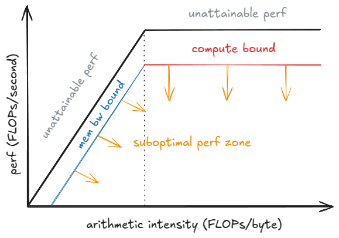
*Roofline 性能模型*

> 📝 **补充说明：** 进行更严谨的分析时，我们还必须考虑 Kernel 的自动调优（Auto-tuning）：随着 $B$ 的增加，运行时可能会切换到针对该 Shape 更高效的 Kernel，从而改变实际达到的性能 $P_{kernel}$。Step 延迟公式为 $t = \text{FLOPs}_{step} / P_{kernel}$。可以看到，当 $P_{kernel}$ 达到硬件峰值 $P_{peak}$ 后，每个 Step 增加计算量将直接导致延迟呈线性上升。

### 如何在 vLLM 中进行性能基准测试

vLLM 提供了 `vllm bench {serve,latency,throughput}` 命令行工具，包装了 `vllm/benchmarks/{server,latency,throughput}.py`。

各个测试脚本的功能如下：
- **latency** — 使用短输入（默认 32 Token）并在小 Batch（默认 8）下采样 128 个输出 Token。它运行多个 Iteration 并汇报 Batch 的端到端延迟。
- **throughput** — 一次性提交固定数量的 Prompt（默认 1000 个 ShareGPT 样例，即 `QPS=Inf` 极速模式），并汇报整个运行过程中的 Input/Output/Total Tokens/s 以及 RPS。
- **serve** — 启动一个真实的 vLLM Server，并通过从泊松分布（或更通用的 Gamma 分布）中采样请求到达时间间隔，来模拟真实世界的流量。它在指定时间窗口内发送请求，测量上述所有指标，并可选地强制开启服务端最大并发控制（通过信号量限制服务端最多 64 个并发请求）。

以下是运行 Latency 测试脚本的示例：

```bash
vllm bench latency \
  --model <model-name> \
  --input-tokens 32 \
  --output-tokens 128 \
  --batch-size 8
```

> 💡 CI 自动化测试中使用的基准测试配置存放在 `.buildkite/nightly-benchmarks/tests` 目录下。

此外，vLLM 还包含一个自动调优（Auto-tune）脚本，通过驱动 Serve 基准测试，寻找能够满足目标 SLO（例如“在保持 p99 E2E < 500ms 的前提下最大化吞吐量”）的最佳参数组合配置。

---

## 结语（Epilogue）

我们从最基础的引擎核心（`UniprocExecutor`）出发，逐步添加了投机解码、Prefix Caching 等高级特性，向上扩展到 `MultiProcExecutor`（`TP/PP > 1`），最后横向扩展，将所有组件封装在异步 Engine 与分布式 Serving 架构中——最后探讨了如何科学地测量系统性能。

vLLM 还包含许多本文未展开讨论的专项优化，例如：
- **异构硬件后端：** TPUs, AWS Neuron (Trainium/Inferentia) 等。
- **复杂架构/技术：** `MLA`, `MoE`, 编解码模型 (如 Whisper), Pooling/Embedding 模型, `EPLB`, `m-RoPE`, `LoRA`, `ALiBi`, 无 Attention 变体, 滑动窗口注意力, 多模态大模型 (VLMs) 以及状态空间模型 (如 Mamba/Mamba-2, Jamba)。
- **TP / PP / SP 并行细节**。
- **异构 KV Cache 逻辑**（Jenga）、更复杂的采样方法（如 Beam Search）等。
- **实验性特性：** 异步调度（Async Scheduling）。

令人赞叹的是，绝大多数特性与前述的主主干流程都是正交解耦的——你几乎可以将它们视为“插件”（当然在工程实践中存在一定的耦合）。

我热爱剖析系统。话虽如此，在如此宏观的高空视角下，部分细节的粒度难免有所妥协。在后续的文章中，我将放大聚焦于各个具体的子系统，深入探究其最硬核的代码细节。

> 💡 **联系作者：** 如果你在文章中发现了任何错误，欢迎给我发私信 - 随时可以在 [X](https://x.com/gordic_aleksa) 或 [LinkedIn](https://www.linkedin.com/in/aleksagordic/) 上联系我，或通过 [匿名反馈表单](https://docs.google.com/forms/d/1z1fEirrN2xtGxAsJvptpM7yV4ByT5SF25S-XiMPrXNA/edit) 提交意见。

---

## 致谢（Acknowledgements）

非常感谢 [Hyperstack](https://www.hyperstack.cloud/) 在过去一年中为我的实验提供 H100 GPU 算力支持！

感谢 [Nick Hill](https://www.linkedin.com/in/nickhillprofile/) (RedHat, vLLM 核心贡献者)、[Mark Saroufim](https://x.com/marksaroufim) (PyTorch)、[Kyle Krannen](https://www.linkedin.com/in/kyle-kranen/) (NVIDIA, Dynamo) 以及 [Ashish Vaswani](https://www.linkedin.com/in/ashish-vaswani-99892181/) 审阅本文预发布版本并提供宝贵反馈！

---

## 参考文献（References）

1. vLLM: [https://github.com/vllm-project/vllm](https://github.com/vllm-project/vllm)
2. "Attention Is All You Need", [https://arxiv.org/abs/1706.03762](https://arxiv.org/abs/1706.03762)
3. "Efficient Memory Management for Large Language Model Serving with PagedAttention", [https://arxiv.org/abs/2309.06180](https://arxiv.org/abs/2309.06180)
4. "DeepSeek-V2: A Strong, Economical, and Efficient Mixture-of-Experts Language Model", [https://arxiv.org/abs/2405.04434](https://arxiv.org/abs/2405.04434)
5. "Jenga: Effective Memory Management for Serving LLM with Heterogeneity", [https://arxiv.org/abs/2503.18292](https://arxiv.org/abs/2503.18292)
6. "Orca: A Distributed Serving System for Transformer-Based Generative Models", [https://www.usenix.org/conference/osdi22/presentation/yu](https://www.usenix.org/conference/osdi22/presentation/yu)
7. "XGrammar: Flexible and Efficient Structured Generation Engine for Large Language Models", [https://arxiv.org/abs/2411.15100](https://arxiv.org/abs/2411.15100)
8. "Accelerating Large Language Model Decoding with Speculative Sampling", [https://arxiv.org/abs/2302.01318](https://arxiv.org/abs/2302.01318)
9. "EAGLE: Speculative Sampling Requires Rethinking Feature Uncertainty", [https://arxiv.org/abs/2401.15077](https://arxiv.org/abs/2401.15077)
10. "Medusa: Simple LLM Inference Acceleration Framework with Multiple Decoding Heads", [https://arxiv.org/abs/2401.10774](https://arxiv.org/abs/2401.10774)
11. LMCache, [https://github.com/LMCache/LMCache](https://github.com/LMCache/LMCache)
