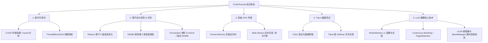

# 6. CUDA 高性能编程与 LLM 推理进阶教程（PaddleJitLab/CUDATutorial 项目解析）

## 1. 项目概述

[PaddleJitLab/CUDATutorial](https://github.com/PaddleJitLab/CUDATutorial) 是一个专为 AI 算子开发与大模型推理加速打造的开源自学教程。该项目以“从零开始，日拱一卒”为核心理念，系统性地梳理了从 **CUDA 基础编程** 到 **高阶算子优化（GEMM/Reduce/Conv）**、**Triton 语言开发**，再到 **LLM 核心推理技术与 vLLM 源码解读** 的完整知识体系。

* **GitHub 仓库**: [PaddleJitLab/CUDATutorial](https://github.com/PaddleJitLab/CUDATutorial)
* **在线文档网站**: [https://cuda.keter.top/](https://cuda.keter.top/)
* **开源协议**: Apache-2.0

---

## 2. 核心课程体系与知识图谱

`CUDATutorial` 项目按难度和应用场景分为 5 大核心模块：

---

## 3. 各模块详细内容拆解

### 🐸 模块一：新手村系列（CUDA 基础入门）
* **CUDA 编程模型概念**：理解 Host（CPU）与 Device（GPU）的架构差异、Kernel 启动语法与内存拷贝。
* **线程分布逻辑**：深刻理解 `Grid -> Block -> Thread` 以及 `Warp`（32 个线程组）的硬件映射，学习如何根据 `threadIdx`、`blockIdx` 和 `blockDim` 计算全局索引。
* **第一个 Kernel 编写**：手写向量加法（Vector Add）等基础 Kernel。
* **性能分析工具**：掌握 `nvprof` / `NCU (NVIDIA Nsight Compute)` 的基本使用，定位 Memory Bound 和 Compute Bound。

---

### ⚔ 模块二：初阶与中阶系列（经典算子性能优化实战）

该模块是教程最精华的部分之一，针对深度学习中最核心的几类算子进行了**手把手递进式优化**：

#### 1. Reduce 算子 5 步优化法
通过 Reduce 累加算子演示硬件级性能调优：
1. **基础实现**：使用共享内存（Shared Memory）进行树状规约。
2. **交叉寻址（Interleaved Addressing）**：解决 Warp Divergence（线程束分流）问题。
3. **消除 Bank Conflict**：调整共享内存访存 stride，避免 32-bank 冲突。
4. **消除空闲线程（Idle Threads Free）**：在数据加载阶段提前完成一次加法，硬件利用率翻倍。
5. **展开最后一个 Warp**：利用 Warp 内隐式同步（Warp-level Primitives）省略 `__syncthreads()` 开销。

#### 2. GEMM（通用矩阵乘法）深度优化
1. **二维 Thread Tile 并行优化**：引入 Shared Memory Block Tile + Register Thread Tile。
2. **向量化访存（Vectorized Access）**：使用 `float4` / `int4` 向量化指令提升 Memory Bandwidth 利用率。
3. **Warp Tiling 拆分**：将 Block Tile 进一步细化为 Warp 级别的计算任务。
4. **Double Buffering（双缓冲/流水线）**：重叠 Shared Memory 数据加载与 Tensor Core/ALU 计算。
5. **Bank Conflict 解决**：Padding 显存布局或 Swizzle 寻址模式。

#### 3. 卷积算子（Convolution）专题
* **Naive Conv**：基础多重循环实现。
* **im2col + GEMM**：将 2D/3D 卷积重排为矩阵乘法。
* **Implicit GEMM（隐式 GEMM）**：无需显式构造巨大的 im2col 临时矩阵，通过 Index 计算直接在 GEMM Kernel 内完成卷积（如 CUTLASS 的优化思路）。

---

### 🚀 模块三：高阶 GPU 特性
* **页锁定内存（Pinned Memory / Host Allocation）**：提高 PCIe 传输带宽并支持 Async Copy。
* **CUDA Streams 多流并发**：利用流水线（Pipeline）实现 Kernel 执行与 Host-Device 传输重叠。
* **多 GPU 计算**：跨卡数据通信与多卡 Kernel 调度。

---

### 💡 模块四：Triton 系列（新一代 AI 算子开发）
随着 OpenAI Triton 的流行，教程提供了从 C++/CUDA 到 Python/Triton 的过渡指南：
* **Triton 编程范式**：块级别（Block-level）的并行思想与自动向量化编译。
* **内存与数据传输**：Triton 中的 `tl.load` / `tl.store` 掩码控制与 Pointer Arithmetic。
* **算子实战**：使用 Triton 手写高性能 Softmax 算子。

---

### 🤖 模块五：LLM 推理技术与 vLLM 源码解读

针对当下大语言模型（LLM）推理系统的关键技术进行了理论与代码双重拆解：

| 专题模块 | 核心剖析内容 |
| :--- | :--- |
| **FlashAttention v1** | 详细拆解 Tiling（分块）与 Online Softmax 算法原理，手写 CUDA 实现以降低 HBM 访存开销 |
| **连续批处理 (Continuous Batching)** | 解析动态 Iteration-level 调度如何解决传统 Static Batching 的 Padding 资源浪费 |
| **PagedAttention** | 剖析借鉴 OS 虚拟内存分页思想的 Paged K/V Cache 管理机制 |
| **vLLM 源码深度解读** | • **架构图谱**：vLLM Engine 整体运行机制 • **预处理**：Tokenizer 与 Token Budget 校验 • **调度器 (Scheduler)**：Prefill / Decode 请求状态机转换 • **BlockManager**：朴素块分配器与 Prefix Caching 块分配器实现 |

---

## 4. 学习建议与项目价值

1. **理论与代码并重**：项目不仅有理论文档，每个优化步骤均配有**可编译运行的源码与 Benchmark 脚本**，非常适合想要从事 AI 芯片/算子开发（CUDA Engineer）和推理引擎开发（Inference Engineer）的学习者。
2. **结合本目录学习路线**：
   * 在阅读完本目录的 `1_kccahe管理架构演进.md` 至 `5_Inside_vLLM.md` 了解推理框架宏观架构后，若想深入**底层 Kernel 编写与 vLLM 源码细粒度实现**，`CUDATutorial` 是极佳的实践参考。
