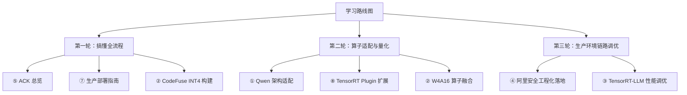

# 8. TensorRT-LLM 完整实战博客精读与算子适配/链路优化面试指南

> **导读**：本章节精选并深度解构了 8 篇来自 NVIDIA 与阿里云官方团队的 TensorRT-LLM 工业级落地实战博客。内容涵盖 **模型算子适配**、**INT4/FP8 深度量化**、**TensorRT Plugin 扩展**、**性能 Benchmarking 调优** 以及 **生产级推理链路优化**，并提炼出贴合工程 JD（推理引擎 / 算子适配 / 性能调优）的 10 大硬核面试问答。

---

## 🔗 8 篇实战博客原文参考链接

1. **博客一**：[NVIDIA《如何在 TensorRT-LLM 中支持 Qwen 模型》](https://github.com/NVIDIA/TensorRT-LLM/tree/main/examples/qwen)
2. **博客二**：[NVIDIA《CodeFuse-CodeLlama-34B INT4 量化和推理优化实践》](https://github.com/codefuse-ai/MFTCoder)
3. **博客三**：[NVIDIA《LLM 推理基准测试：使用 TensorRT-LLM 进行性能调优》](https://developer.nvidia.com/zh-cn/blog/benchmarking-llm-inference-optimizing-performance-with-tensorrt-llm/)
4. **博客四**：[NVIDIA × 阿里《阿里安全使用 NeMo 和 TensorRT-LLM 的大模型工程化落地实践》](https://developer.nvidia.com/blog/)
5. **博客五**：[阿里云《大语言模型推理提速，TensorRT-LLM 高性能推理实践》](https://developer.aliyun.com/article/1393664)
6. **博客六**：[阿里云《使用 TensorRT LLM 量化与推理部署 Qwen 模型》](https://developer.aliyun.com/article/1458000)
7. **博客七**：[阿里云《使用 TensorRT-LLM 进行生产环境的部署指南》](https://developer.aliyun.com/article/)
8. **博客八**：[NVIDIA《TensorRT 中的自定义层》](https://docs.nvidia.com/deeplearning/tensorrt/developer-guide/index.html#extending-tensorrt) & [阿里云《初识 TensorRT Plugin》](https://developer.aliyun.com/article/1053744)

---

## 1. 核心实战博客精读与工程拆解

### 📌 博客一：[NVIDIA《如何在 TensorRT-LLM 中支持 Qwen 模型》](https://github.com/NVIDIA/TensorRT-LLM/tree/main/examples/qwen)
* **核心焦点**：**新模型 / 未支持算子适配全流程（模型定义到 Engine 生成）**
* **JD 匹配度**：★★★★★（直接对应“模型适配与算子移植”）
* **技术链路拆解**：
  1. **建立 Model Definition 与 Weight Mapping**：参考现有 Llama 架构定义，重构 HuggingFace 权重名称到 TensorRT-LLM 张量的映射规则。
  2. **数值对齐与 Debug 调试**：构建 Engine 成功但输出乱码时，采用**逐层（Layer-by-layer）Mean / Sum / Tensor Shape 校验法**，对比 HuggingFace Reference 输出定位差异。
  3. **Attention Plugin 参数调优**：定位 RoPE 位置编码与 QKV 拆分细节，正确配置 `gpt_attention_plugin` 插件参数。
  4. **量化阶梯式演进**：`FP16 跑通 -> Weight-Only INT8/INT4 -> SmoothQuant (W8A8)`。
* **面试价值**：证明你具备“将开源新模型接入底层推理引擎”的能力，而非仅仅调用现成 CLI。

---

### 📌 博客二：[NVIDIA《CodeFuse-CodeLlama-34B INT4 量化和推理优化实践》](https://github.com/codefuse-ai/MFTCoder)
* **核心焦点**：**FP/BF16 到 W4A16 深度量化落地与 Build 参数全解**
* **JD 匹配度**：★★★★★（直接对应“模型量化与性能压榨”）
* **完整构建链路**：
  $$\text{FP/BF16 模型} \xrightarrow{\text{GPTQ 校准}} \text{W4A16 Safetensors} \xrightarrow[\text{配置量化参数}]{\text{trtllm-build}} \text{TensorRT Engine} \xrightarrow{\text{HumanEval 评测}}$$
* **关键编译参数解析**：
  * `weight_only_precision=int4_gptq` & `use_weight_only`：启用 GPTQ 权重量化 Kernel。
  * `per_group`：基于 Group 粒度做 Scale / Zero-Point 缩放，平衡精度与显存开销。
  * `gpt_attention_plugin=fp16` & `gemm_plugin=fp16`：结合混合精度插件加速计算。
* **校准集数据分布对齐**：强调 GPTQ 校准数据必须与真实业务 Prompt 分布一致，否则量化误差放大会导致模型逻辑崩溃。CodeFuse 实践中成功将 INT4 相比 BF16 的 Pass@1 精度损失控制在仅 0.6%。

---

### 📌 博客三：[NVIDIA《LLM 推理基准测试：使用 TensorRT-LLM 进行性能调优》](https://developer.nvidia.com/zh-cn/blog/benchmarking-llm-inference-optimizing-performance-with-tensorrt-llm/)
* **核心焦点**：**性能测试方法论与 SLA 约束下的 Pareto 最优化**
* **JD 匹配度**：★★★★★（对应“链路调优与 Benchmark”）
* **核心观测指标矩阵**：
  * **TTFT (Time to First Token)**：首字延迟。
  * **TPOT (Time Per Output Token)**：输出 Token 间延迟（即打字机流畅度）。
  * **Throughput (Tokens/s & QPS)**：系统每秒总 Token 数和并发请求数。
  * **P50 / P90 / P95 / P99 Latency**：尾部延迟分布。
* **核心优化思维转换**：**性能优化绝非“Tokens/s 越高越好”**。随着并发数（Concurrency）升高，吞吐量升高，但 TTFT/TPOT 和 P99 延迟也会急剧恶化。工程师的目标是在业务 SLA 限制（如 TTFT < 200ms, P99 < 500ms）下寻找 **Pareto 最优化曲线点**。

---

### 📌 博客四：[NVIDIA × 阿里《阿里安全使用 NeMo 和 TensorRT-LLM 的大模型工程化落地实践》](https://developer.nvidia.com/blog/)
* **核心焦点**：**生产级部署全链路优化与动态 Batching 减气泡**
* **JD 匹配度**：★★★★★（对应“大厂生产推理系统落地”）
* **生产部署 DAG 链路**：
  $$\text{模型校验/标准化} \rightarrow \text{TensorRT-LLM 编译 Engine} \rightarrow \text{服务 DAG 编排} \rightarrow \text{调试} \rightarrow \text{K8s 部署}$$
* **消除计算气泡（Bubbles）**：解构 LLM 生成阶段因为不同请求输出长度差异导致 Batch 内大量 GPU 单元处于等待（Padding 气泡）的问题。通过**动态 Batching（In-Flight Batching）**与请求级抢占调度，降低了 30% 以上的无效计算步骤，在实际生产线上实现了 **QPS 2~3 倍的剧增**。

---

### 📌 博客五：[阿里云《大语言模型推理提速，TensorRT-LLM 高性能推理实践》](https://developer.aliyun.com/article/1393664)
* **核心焦点**：**TensorRT-LLM 四大优化支柱全景图**
* **JD 匹配度**：★★★★☆
* **四大支柱解构**：
  1. **Quantization（量化矩阵）**：W8A8 (SmoothQuant)、W4A16 (AWQ / GPTQ)、W8A16。
  2. **In-Flight Batching**：Iteration 级动态混包。
  3. **Attention 进化**：MHA $\rightarrow$ MQA $\rightarrow$ GQA 配合 PagedAttention 显存优化。
  4. **Graph Rewriting**：编译期的计算图重写与层融合（Layer Fusion）。

---

### 📌 博客六：[阿里云《使用 TensorRT LLM 量化与推理部署 Qwen 模型》](https://developer.aliyun.com/article/1458000)
* **核心焦点**：**两阶段构建流命令行深度解操**
* **JD 匹配度**：★★★★☆
* **核心问题辨析：`convert_checkpoint` 与 `trtllm-build` 是同一回事吗？**
  * **不是**。`convert_checkpoint.py` 负责数据格式与权重的提取、量化缩放因子计算（如 GPTQ/AWQ）与分片切分（TP/PP）；`trtllm-build` 则是 TensorRT 编译器，负责把 Checkpoint 转化为 GPU 底层硬件指令的 `.engine` 文件。

---

### 📌 博客七：[阿里云《使用 TensorRT-LLM 进行生产环境的部署指南》](https://developer.aliyun.com/article/)
* **核心焦点**：**从编译器角度理解为什么需要 Build Engine**
* **JD 匹配度**：★★★★☆
* **编译器视角构建拓扑图**：

```
PyTorch / HuggingFace Model
       │
       ▼
TensorRT-LLM Network / Checkpoint
       │
       ├── Precision (FP16 / FP8 / INT4)
       ├── Plugins (gpt_attention_plugin, gemm_plugin)
       ├── Parallelism (TP_size, PP_size)
       ├── Shapes & Profiles (max_batch_size, max_input_len)
       └── Quantization Config
       │
       ▼
TensorRT Builder (编译器核心)
       │
       ├── Graph Optimization (消除无用节点)
       ├── Layer Fusion (融合 Conv+Bias+ReLU / QKV Fusion)
       ├── Kernel / Tactic Selection (自动测量评估最佳 CUDA Kernel)
       └── Memory Planning (复用 Activation 显存)
       ▼
TensorRT Engine (.engine 二进制)
```

---

### 📌 博客八：[NVIDIA《TensorRT 中的自定义层》](https://docs.nvidia.com/deeplearning/tensorrt/developer-guide/index.html#extending-tensorrt) & [阿里云《初识 TensorRT Plugin》](https://developer.aliyun.com/article/1053744)
* **核心焦点**：**自定义算子扩展（TensorRT Plugin）与开销陷阱**
* **JD 匹配度**：★★★★★（对应“自定义 Kernel 与 Plugin 适配”）
* **Plugin 三大核心工程用途**：
  1. **算子补齐**：TensorRT 原生不支持某个前沿算子 $\rightarrow$ 手写 Plugin。
  2. **手工融合**：TensorRT 自动融合未触发 $\rightarrow$ 手动编写融合 Plugin（如 Fused LayerNorm + Attention）。
  3. **性能替换**：原生算子 Kernel 效率较低 $\rightarrow$ 手写高精细度 CUDA/Cutlass Kernel 替换。
* **⚠️ 面试高风险避坑点**：**“写 Plugin”不等于“性能一定变快”！**
  * **原因**：引入自定义 Plugin 会打断 TensorRT 原生的跨层图融合机制机制；此外，若 Plugin 输入输出的数据格式（Format / Layout）与前后层不一致，会引入额外的隐式数据转置（Format Conversion）开销，导致整体性能不升反降。

---

## 2. 三轮学习路线图



---

## 3. 面试必背：10 大硬核问答模板

### Q1: TensorRT-LLM 从 HuggingFace 模型到 Engine 经历哪些步骤？`convert_checkpoint` 和 `trtllm-build` 分别做什么？
> **回答模板**：
> 经历“**权重提取与量化切分（Checkpoint Conversion）**”和“**计算图编译与 Kernel 选择（Engine Building）**”两阶段。
> * `convert_checkpoint.py`：负责读取 HF 模型权重，提取 Scale 缩放因子，执行离线量化（如 GPTQ/AWQ），并按 TP/PP 尺寸切分张量，保存为统一格式。
> * `trtllm-build`：是 TensorRT 编译器核心，负责针对目标 GPU 进行图重写、层融合、Plugin 注入、内存复用规划以及测定选择最优 CUDA Kernel (Tactic)，生成最终的 `.engine` 硬件二进制。

### Q2: W4A16（Weight-Only INT4）在 Decode 阶段为什么性能提升特别明显？
> **回答模板**：
> LLM 在 Decode 阶段是典型的 **Memory-Bound（访存密集型）** 任务，瓶颈在于 GPU 显存带宽而非算力。W4A16 将权重压缩至 4-bit，减少了 75% 的模型权重显存传输量（BW），使得每一个 Token 载入权重的延迟大幅降低。虽然在计算前需要调用 Fused GEMM Kernel 进行反量化（Dequant）回 FP16，但计算开销远小于节省的访存开销，因此提升显著。

### Q3: 为什么 W4A16 理论压缩了 4 倍，但端到端加速达不到 4 倍？
> **回答模板**：
> 1. **非 100% 内存传输占用**：除了加载权重，还有 KV Cache 访存开销（未完全压缩）以及 Activation 显存传输；
> 2. **反量化开销**：INT4 到 FP16 的动态 Dequantize 引入了额外的计算与寄存器开销；
> 3. **Prefill 阶段受限**：Prefill 阶段是 Compute-Bound，W4A16 反而因为解包计算开销可能导致 Prefill 变慢；
> 4. **系统级开销**：包含 CPU 调度、Network I/O、Kernel Launch 延迟等固定的系统 Overhead。

### Q4: 什么是 SmoothQuant (W8A8)？它解决了激活值的什么痛点？
> **回答模板**：
> LLM 在激活值（Activation）中存在严重的 **Outliers（异常离群值）**，直接对 Activation 进行 INT8 量化会导致精度剧烈崩塌。SmoothQuant 提出通过一个平滑因子（Smoothing Factor $s$），将 Activation 中难量化的 Outliers 转移到 Weight 上（即 $Y = (X \cdot \text{diag}(s)^{-1}) \cdot (\text{diag}(s) \cdot W)$），由于 Weight 本身分布较均匀，吸收 Outliers 后依然能进行高质量 INT8 量化，从而实现了数学等价的 W8A8 矩阵乘加速。

### Q5: GEMM plugin 和 GPT Attention plugin 为什么能大幅加速推理？
> **回答模板**：
> * **GPT Attention Plugin**：融合了 FlashAttention / PagedAttention 算子，将 QK 点积、Softmax、V 加权合并在一个 CUDA Kernel 内完成，大幅减少了中间结果写回 HBM 的次数。
> * **GEMM Plugin**：集成了 Cutlass / Tensor Core 极优 Kernel，针对特定 Shape（Batch Size, Sequence Length）做了手写矩阵乘法优化与量化解包融合（Fused Dequantization）。

### Q6: 什么时候该写 TensorRT Plugin？写 Plugin 一定能带来性能提升吗？
> **回答模板**：
> 只有当 TensorRT 原生不支持某算子、自动融合失败或原生 Kernel 性能太差时才手写 Plugin。
> **写 Plugin 不一定变快**，因为：① Plugin 属于黑盒算子，会**切断 TensorRT 的前后层图融合（Layer Fusion）**；② 若 Plugin 的输入输出 Layout（如 NCHW vs NHWC）与前后层不匹配，会自动插入低效的 **Reformat 节点** 带来转置开销。

### Q7: GPTQ 和 AWQ 量化算法有什么区别？
> **回答模板**：
> * **GPTQ**：基于二阶导数 Hessian 矩阵的逐层逐列优化（OBQ 思想），寻找使量化重构误差最小的权重矩阵，计算较快，依赖校准集。
> * **AWQ (Activation-aware Weight Quantization)**：观察到只有 1% 的显著权重（Salient Weights）对精度至关重要，通过分析 Activation 幅值找到保护显著权重的通道 Scale，保护关键权重不发生剧烈量化舍入，精度稳定性通常高于 GPTQ。

### Q8: 在 TensorRT-LLM 中遇到 Unsupported Operator（未支持算子）怎么解决？
> **回答模板**：
> 1. **等价算子拆解重组**：在 Python 端网络定义中用现有 TensorRT 原生算子组合替代；
> 2. **自定义 TensorRT Plugin**：使用 C++/CUDA 编写 `IPluginV2DynamicExt` 插件接口实现算子；
> 3. **PyTorch / Torchscript 外挂调用**：在框架层面进行子图切分（Fallback 至 PyTorch 执行，但会引入 Host/Device 同步开销）。

### Q9: 性能压榨中，Throughput、TTFT、TPOT 和 Concurrency 如何权衡？
> **回答模板**：
> 它们在系统物理资源（算力/带宽/显存）上存在 **Trade-off**。提升 Concurrency（并发数）与 Batch Size 可以提升硬件利用率，使吞吐量（Throughput）升高；但会增加排队延迟与 KV Cache 显存竞争，导致首字延迟（TTFT）和字间延迟（TPOT）恶化。工程落地中需要设定 **SLA 约束（如 P99 TTFT < 200ms）**，在该临界点以内寻找最大吞吐量的 Batch / Concurrency 最佳配置文件（Pareto 最优曲线点）。

### Q10: 面试官问“你做的推理链路优化具体包含哪些维度”时怎么回答？
> **回答模板**：
> 推理链路优化是一个端到端的系统工程，我会从 7 个维度层层推进：
> 1. **模型与量化层**：ModelOpt 剪枝/量化 (W4A16/FP8/SmoothQuant) 与校准集分布对齐；
> 2. **Kernel 与编译器层**：TensorRT-LLM 图重写、层融合、GEMM/Attention 插件注入与自定义 Plugin 优化；
> 3. **KV Cache 内存层**：PagedAttention 物理块动态管理、Prefix Caching 重用与块大小调优；
> 4. **Batch 调度层**：In-Flight Batching (Continuous Batching) 与 Chunked Prefill 消除计算气泡和 Head-of-Line 阻塞；
> 5. **Runtime 架构层**：CUDA Graph 捕获与多流 (CUDA Stream) 异步重叠；
> 6. **集群并行层**：TP/PP 张量与流水线并行切分及 NVLink 通信算子融合；
> 7. **Serving 与调度层**：OpenAI 兼容 API 接入、服务 DAG 编排与 K8s 扩缩容策略。
