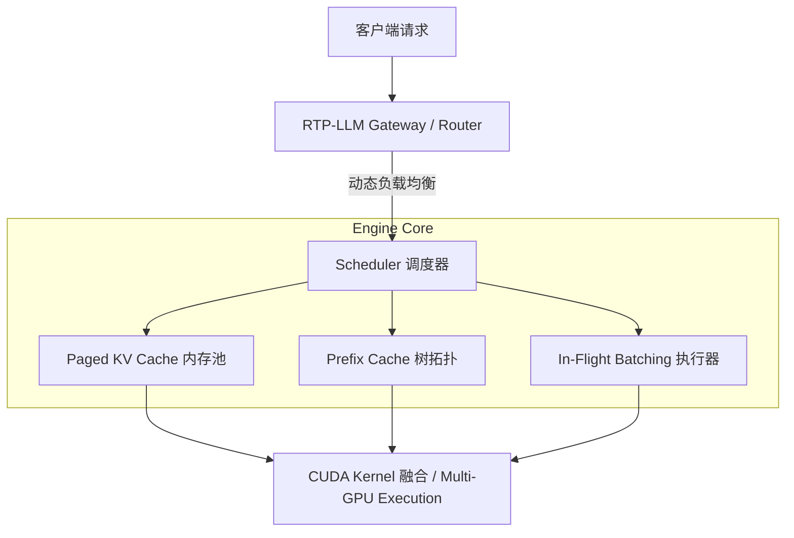

# 9. 阿里 RTP-LLM 工业级大模型推理引擎架构与生产实践

> **导读**：阿里巴巴开源的 **RTP-LLM (Real-time Prediction LLM Engine)** 是经过淘宝问问、阿里云 OpenSearch 等海量高并发真实业务锤炼的工业级 LLM 推理引擎。本章节深度解构 RTP-LLM 的底层架构设计、KV-Cache 内存管理与复用机制、动态负载均衡调度以及生产环境中常见的 OOM 与负载倾斜治理方案。
> 
> * **参考博客**：[RTP-LLM：工业级大模型推理引擎核心技术与生产部署指南](https://blog.csdn.net/weixin_28733651/article/details/160873559)
> * **GitHub 仓库**：[alibaba/rtp-llm](https://github.com/alibaba/rtp-llm)

---

## 1. 为什么是 RTP-LLM？工业级推理系统的核心挑战

在真实线上高并发场景（如淘宝智能客服、大模型 Agent），推理系统面临三座大山：
1. **显存墙（Memory Wall）与 OOM 风险**：模型权重加上随并发膨胀的 KV Cache 极易导致显存溢出（OOM）。
2. **长尾延迟与负载倾斜（Load Imbalance）**：Prompt 长度从几十到上万 Token 不等，静态 Batching 会导致严重的气泡（Padding Bubbles）和长尾卡顿。
3. **高并发下的资源重复浪费**：多轮对话和公共 System Prompt 中存在大量重复的计算与 KV Cache 冗余。

RTP-LLM 的核心目标是：**用尽可能少的硬件资源，支撑尽可能高的在线推理吞吐量，同时保证极致低延迟与生产级别的稳定性。**

---

## 2. RTP-LLM 核心技术架构解构

### 2.1 PagedAttention 虚拟 KV-Cache 内存管理
* **物理-逻辑页表映射**：借鉴操作系统虚拟内存思想，将连续的 KV Cache 显存分割为固定大小的物理 Block（如 16/32 Tokens/Block）。
* **按需分配（Allocation-on-demand）**：仅在生成新 Token 时动态向显存池申请 Block，避免了传统静态预分配导致的显存碎片与巨大浪费。
* **显存利用率提升**：将 KV Cache 的显存空闲率降至 < 1%，直接支持更大 Batch Size 的高并发处理。

### 2.2 KV-Cache 前缀复用（Prefix Caching & Radix Tree）
* **原理**：基于 Radix Tree（基数树）建立系统 Prompt 和多轮对话 History 的 KV Cache 索引。
* **收益**：当多个用户使用相同的 System Prompt（或同一用户在第 N 轮对话）时，新请求直接复用已计算好的 KV Cache，Prefill 阶段计算量降低 50%~90%，首字延迟（TTFT）大幅下降。

### 2.3 持续批处理（In-Flight / Continuous Batching）
* **Iteration 级调度**：在每一个 Transformer Layer 的前向传播步骤中，动态插入新到的 Prefill 请求或弹出已完成生成（EOS）的请求。
* **消除 Padding 气泡**：不再需要等待 Batch 内最长的序列生成结束，大幅提升 GPU 算力利用率。

---

## 3. 生产环境两大经典难题治理

### 3.1 生产环境 OOM 避坑与水线控制
线上生产环境突然遇到超级长 Prompt 时，极易触发 OOM 崩溃。RTP-LLM 的防爆策略包括：
* **显存预留水线（Memory Watermark）**：保留 5%~10% 的显存安全缓冲区。
* **请求抢占与 Swap 机制（Preemption & Swap to Host）**：当显存不足时，按优先级抢占后进请求，将该请求的 KV Cache 暂时 Swap Out 到 CPU 内存，待显存空闲后再 Swap In 恢复。
* **Chunked Prefill**：超长 Prompt 强制分块处理，避免单请求突发独占显存与算力。

### 3.2 动态负载均衡与流量倾斜（Load Imbalance）
* **长短请求分离调度**：识别长 Prompt 与短 Prompt，防止长 Prompt 阻塞低延迟敏感请求。
* **集群级并发路由**：Gateway 根据每个 Worker 节点的当前 KV Cache 剩余容量和正在运行的 Request 数动态分发，避免单节点卡死。

---

## 4. 面试干货：RTP-LLM 与主流推理引擎对比

| 维度 | **RTP-LLM** | **vLLM** | **TensorRT-LLM** |
| :--- | :--- | :--- | :--- |
| **背景** | 阿里工业级高并发在线生产 | 开源社区主流框架 | NVIDIA 官方硬件极速引擎 |
| **前缀复用** | 高效 Radix Tree 前缀复用 | Block Hash 级 Prefix Caching | Lookahead / Stateful KV |
| **调度稳定性** | 针对线上长尾与 OOM 容错优化极深 | 社区快速迭代，易用性强 | 编译期 Shape 约束较硬 |
| **适用场景** | 复杂业务 DAG、高并发电商/搜索 | 通用科研与快速原型部署 | 极致单模型性能压榨 |
